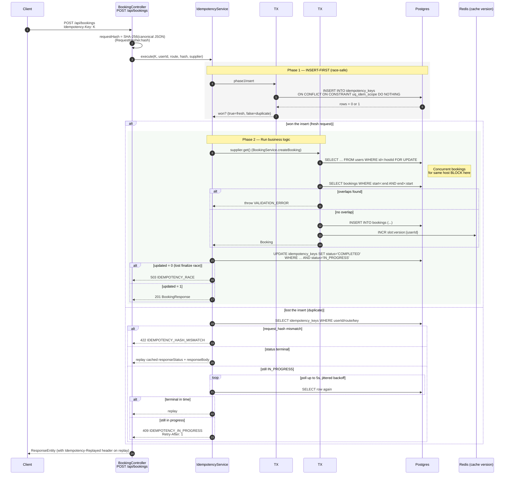
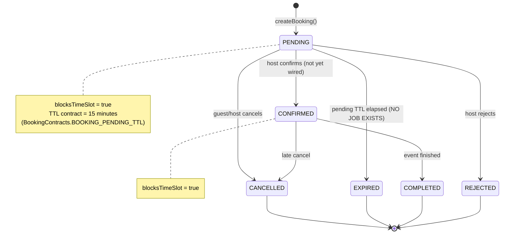
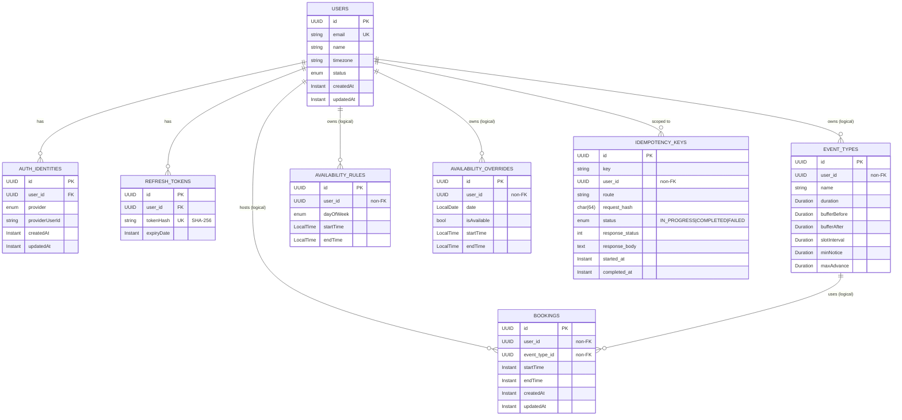
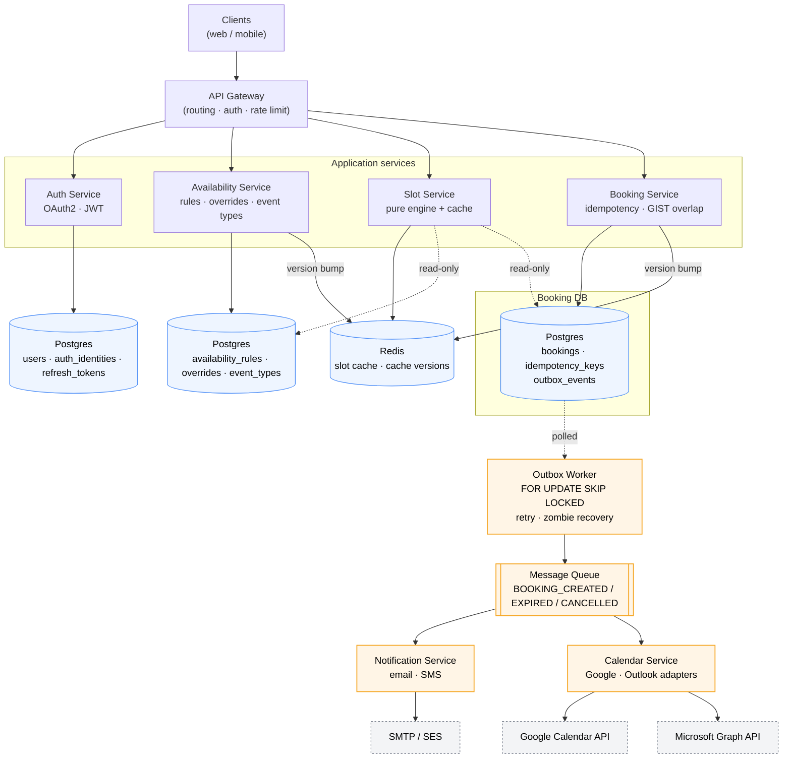
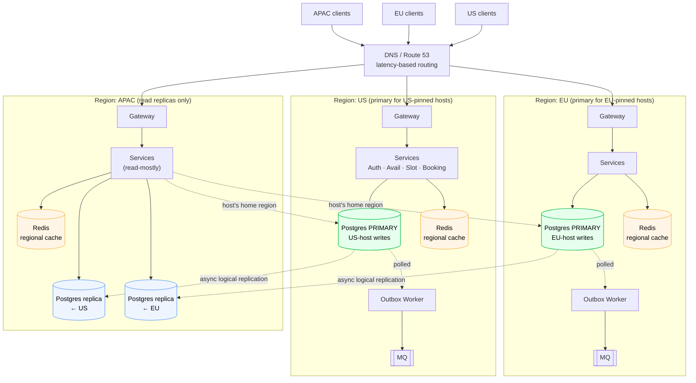
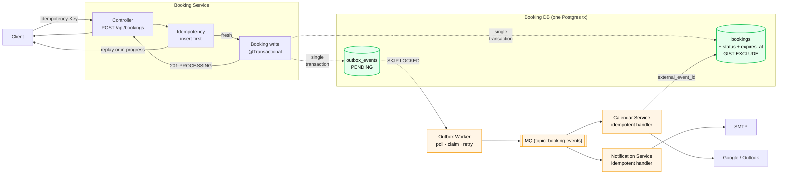

# easySchedule — Production Architecture

> **Source of truth.** This document is reverse-engineered from the code at commit `bd165a4` (branch `booking`). Where it conflicts with the HLD/LLD, **trust this document** — every concurrency claim, diagram, and "this is/is not safe" judgement carries a `file:line` citation.
>
> Companion file: [`FIXES.md`](./FIXES.md) — ranked remediation plan for the gaps named here.

---

## Table of Contents

1. [Executive Summary](#1-executive-summary)
2. [System Overview](#2-system-overview)
3. [Architecture Diagrams](#3-architecture-diagrams)
4. [Availability & Slot Generation Deep Dive](#4-availability--slot-generation-deep-dive)
5. [Booking System Deep Dive](#5-booking-system-deep-dive)
6. [Concurrency & Consistency](#6-concurrency--consistency)
7. [Data Architecture](#7-data-architecture)
8. [Multi-Region Strategy Analysis](#8-multi-region-strategy-analysis)
9. [Async & Outbox Pattern](#9-async--outbox-pattern)
10. [Failure Scenarios](#10-failure-scenarios)
11. [Scalability Analysis](#11-scalability-analysis)
12. [Observability](#12-observability)
13. [Technical Risks & Gaps](#13-technical-risks--gaps)
14. [Future Evolution Plan](#14-future-evolution-plan)
15. [Appendix](#15-appendix)
16. [Target Architecture (Post-Fixes & Scaled System)](#16-target-architecture-post-fixes--scaled-system)

---

## 1. Executive Summary

**What it does.** easySchedule is a Calendly-style scheduling platform: hosts publish availability rules; guests view computed slots and create bookings. Today it serves a single region from one Spring Boot 4.0.6 service backed by Postgres 16 and Redis.

**Architecture style.** Modular monolith. Four packages map cleanly to potential services: `auth`, `availability`, `booking`, `common`.

**Core strengths (validated in code).**
- **Idempotency engine is well-engineered.** Insert-first with `INSERT … ON CONFLICT DO NOTHING` in a `REQUIRES_NEW` transaction, `WHERE status='IN_PROGRESS'` finalize-or-race, exponential-backoff polling with jitter, reaper at 1 min, purge at 15 min. (`IdempotencyService.java:43-162`, `IdempotencyKeyCleanupJob`.)
- **Slot engine is pure, deterministic, and version-coalesced.** `SlotGenerationEngine.compute()` is a static function with no I/O; `SlotService` reads a per-user cache version, computes on miss, re-checks the version after the fetch, and skips writing the cache on drift. Concurrent requests for the same key share a single in-flight `CompletableFuture` (`SlotCacheService.java:124-171`, `SlotService.java:91-114`).
- **DB clock for business decisions.** `TimeSource` is wired to `DbClockRepository.now()` which executes `SELECT now()` (`DbClockRepository.java:14-38`). No code path uses wall-clock `Instant.now()` for booking or idempotency timing.

**Critical risks (validated in code).**

| # | Risk | Evidence | Severity |
|---|------|----------|----------|
| R1 | No DB-level overlap constraint on `bookings`. Conflict prevention rests entirely on a `SELECT … FOR UPDATE` on the `users` row. | `Booking.java:1-48` (no constraint, no `@Version`); `BookingService.java:42-54` | 🔴 |
| R2 | Booking `status` and `expires_at` are **not persisted**. The `BookingState` enum and transition matrix exist in code but are never written to the database. | `Booking.java:1-48` (no `status`/`expires_at` columns); `BookingState.java`; `BookingStateTransitions.java` | 🔴 |
| R3 | No PENDING-expiry job. `BOOKING_PENDING_TTL = 15min` is contractual, not enforced. | `BookingContracts.java:48`; no `@Scheduled` job for booking expiry | 🔴 |
| R4 | No outbox / no MQ. Calendar fan-out and notifications, called out as the "consistency backbone" in the HLD, do not exist. | grep `outbox` → 0 hits; no Kafka/JMS/SQS dependency in `build.gradle` | 🔴 |
| R5 | **`ddl-auto: create` is UNSAFE FOR PRODUCTION DEPLOYMENT.** Hibernate runs `DROP SCHEMA … CASCADE` followed by `CREATE` on **every JVM startup**. Every booking, every user, every refresh token, every idempotency key is permanently destroyed on every deploy, every crash, every container restart, every autoscaler event. There is no recovery — the data does not exist anywhere else. A single rolling deploy with this setting is a total data loss event. The Flyway migrations in the repo are advisory in this mode and are not authoritative. **This setting must be changed to `validate` before any production traffic ever touches this service.** | `application.yaml:11-14` | 🔴 |
| R6 | JWT secret has a hardcoded default; CSRF disabled; CORS not configured. | `application.yaml:53`; `SecurityConfig` | 🔴 |
| R7 | The user-row pessimistic lock serializes all booking creation for one host — celebrity-host hotspot. | `UserRepository.findByIdForUpdate` used unconditionally | 🟡 |
| R8 | Calendar integration & notifications (`CalendarPort`, `NotificationPort`) are not implemented. Slot engine accepts `calendarBusy` but the supplier hard-codes `List.of()` (`SlotService.java:148`). | — | 🟡 |

**Bottom line.** The pieces that are built are built well. The pieces that are missing — booking state persistence, an expiry job, a DB exclusion constraint, an outbox — are exactly the pieces that determine whether the system is *safe* under high concurrency and *complete* under partial failure. The system today is correct under low load with a single region; it is **not** ready for global scale or microservice extraction without [`FIXES.md`](./FIXES.md) #1–#4 first.

---

## 2. System Overview

**Stack.** Java 17, Spring Boot 4.0.6, Spring Data JPA, Spring Security + OAuth2 client, JJWT 0.12.6. Postgres 16 (alpine, docker-compose), Redis (Spring Data Redis starter). Micrometer + OTLP exporter targeting an OpenTelemetry Collector. Flyway migrations in place. (`build.gradle`, `docker-compose.yaml`.)

**Implemented modules.**

```
com.daedalussystems.easySchedule
├── auth/                                  # Implemented
│   ├── controller/  service/  repository/
│   ├── domain/{user,identity,token}       # User, AuthIdentity, RefreshToken
│   ├── oauth/{adapter,handler,service}    # Google, Microsoft adapters
│   └── security/{config,filter,jwt}       # JwtAuthenticationFilter, SecurityConfig
│
├── availability/                          # Implemented
│   ├── domain/                            # AvailabilityRule, AvailabilityOverride, EventType
│   ├── engine/                            # Pure: SlotGenerationEngine, IntervalUtils, TimeInterval
│   ├── service/                           # SlotService, AvailabilityService
│   ├── cache/                             # SlotCacheService, SlotCacheVersionService
│   ├── identity/                          # SlotIdGenerator
│   ├── repository/                        # plus DbClockRepository (implements TimeSource)
│   ├── controller/  dto/  mapper/  validation/
│
├── booking/                               # Implemented
│   ├── controller/  service/  repository/
│   ├── domain/                            # Booking
│   ├── contract/                          # BookingState, BookingStateTransitions, BookingContracts
│   ├── idempotency/                       # IdempotencyService, IdempotencyKey, IdempotencyKeyRepository, IdempotencyKeyCleanupJob
│   └── dto/
│
└── common/                                # Implemented
    ├── api/                               # ApiResponse / ErrorResponse
    ├── audit/                             # BaseEntity (createdAt, updatedAt)
    ├── config/                            # JacksonConfig, SchedulingConfig, OpenApiConfig
    ├── enums/                             # ErrorCode, AuthProvider, UserStatus, IdempotencyStatus
    ├── exception/                         # GlobalExceptionHandler, CustomException
    ├── time/                              # TimeSource interface
    └── util/                              # RequestHasher, TimezoneUtil
```

**Absent modules** (named in HLD; **not present** in the codebase):

- `calendar/` — no `CalendarPort`, no Google/Outlook integration, no `calendar_accounts` table.
- `notification/` — no `NotificationPort`, no email/SMS adapter.
- `outbox/` — no `OutboxEvent` entity, no claim query, no worker, no MQ binding.
- `common/lock/` — no Redis distributed lock; HLD's `lock:{hostId}:{slot}` does not exist.
- `scheduling/strategy/` — slot generation lives directly in `availability/engine/` rather than a strategy interface.

**Infrastructure.**
- **Postgres 16** — single primary, no replicas configured.
- **Redis** — slot cache + per-user cache version counter (`SlotCacheVersionService`). Not used for sessions (auth is stateless JWT) or for distributed locks.
- **OTLP collector** (otel-collector-contrib) — receives metrics over HTTP/4318 and gRPC/4317; current pipeline routes only metrics to a `debug` exporter (`otel-collector-config.yaml`).

---

## 3. Architecture Diagrams

### 3.1 Multi-Region Architecture

**Today**: single region.

```
            ┌─────────────────────────────────────┐
            │             Clients                 │
            └─────────────────┬───────────────────┘
                              │ HTTPS
                              ▼
                  ┌────────────────────────┐
                  │  Spring Boot 4.0.6     │
                  │   (single instance)    │
                  └───┬──────────┬─────────┘
                      │          │
                ┌─────▼────┐ ┌───▼────────┐
                │ Postgres │ │   Redis    │
                │   (16)   │ │ slot cache │
                │ primary  │ │ + versions │
                └──────────┘ └────────────┘
                      │
                      ▼
                ┌──────────────────┐
                │ OTLP Collector   │
                │   (metrics)      │
                └──────────────────┘
```

**Aspirational (HLD, not implemented)**: APAC/EU read replicas, US primary, Route53 latency routing, async replication. The implications of that topology are analyzed in [§8](#8-multi-region-strategy-analysis).

### 3.2 Booking Write Flow (Critical Path)



Citations: `BookingController.java:33-58`, `IdempotencyService.java:43-162`, `BookingService.java:31-67`, `IdempotencyKeyRepository.java`.

### 3.3 Slot Generation Flow

```mermaid
sequenceDiagram
    autonumber
    participant C as Client
    participant Svc as SlotService.getSlots
    participant Ver as SlotCacheVersionService
    participant Cache as SlotCacheService
    participant Eng as SlotGenerationEngine<br/>(pure, static)
    participant Pg as Postgres
    participant Rds as Redis

    C->>Svc: GET slots(userId, eventTypeId, date)
    Svc->>Pg: load User (timezone), EventType
    Svc->>Ver: snapshotVersion = getCurrentVersion(userId)
    Svc->>Cache: getOrCompute(key=v=snapshot, supplier)
    Cache->>Rds: GET slots:v2:{u}:{et}:{d}:v{V}

    alt cache hit
        Rds-->>Cache: payload
        Cache-->>Svc: CachedSlots
    else cache miss
        rect rgb(240,245,250)
        note over Cache: per-key inFlightV2.putIfAbsent<br/>(coalesces concurrent callers)
        Cache->>Cache: first caller runs supplier;<br/>others block on the shared Future
        end
        Cache->>Pg: now = SELECT now()<br/>(DbClockRepository)
        Cache->>Pg: rules, override, day's bookings
        Cache->>Eng: compute(SlotInput)
        Eng->>Eng: buildBaseIntervals → applyOverride →<br/>generateGridSlots (ceilToGrid) →<br/>removeOverlaps(bookings) →<br/>removeOverlaps(calendarBusy=∅) →<br/>applyBufferFilter →<br/>applyConstraints (minNotice/maxAdvance) →<br/>cap MAX_SLOTS_PER_DAY=200
        Eng-->>Cache: List<SlotUtc>
        Cache->>Ver: postFetchVersion = getCurrentVersion(userId)
        alt postFetchVersion == snapshotVersion
            Cache->>Rds: SETEX key payload TTL=60s
        else version drifted
            note right of Cache: Skip cache write.<br/>Result still returned;<br/>next request misses & recomputes.
        end
        Cache-->>Svc: CachedSlots
    end

    Svc->>Svc: stampSlotIds(cached, hostId, eventTypeId, snapshotVersion)
    Svc-->>C: SlotResponse(slots with deterministic slotIds, version)
```

Citations: `SlotService.java:68-115`, `SlotService.java:117-174`, `SlotCacheService.java:124-171`, `SlotGenerationEngine.java:22-63`.

### 3.4 Booking Lifecycle State Machine

> **CAVEAT**: This state machine **exists only in code** (`BookingState`, `BookingStateTransitions`). The `Booking` JPA entity has no `status` column. Until that gap is closed (see [`FIXES.md`](./FIXES.md) #3), every booking implicitly created by `BookingService.createBooking` is in an undefined state from the database's perspective.



Forbidden transitions enforced by `BookingStateTransitions.requireAllowed`: `CONFIRMED→EXPIRED`, `PENDING→COMPLETED`, anything out of a terminal state. Self-transitions (`from == to`) are no-ops to support at-least-once async retries (`BookingStateTransitions.java:85-98`).

### 3.5 Entity Relationship Diagram



Notes flagged on the diagram:
- "non-FK" means the column carries a `UUID user_id` but **no JPA `@ManyToOne` relationship and no Postgres FK constraint**. Referential integrity is enforced only in service code. This is intentional for future microservice extraction but means today an orphaned booking can exist if a user is hard-deleted.
- `IDEMPOTENCY_KEYS` is the only table currently created via Flyway migration (`V2_0__idempotency_keys.sql`); all other tables are JPA-generated under `ddl-auto: create` (see [§7](#7-data-architecture)).

---

## 4. Availability & Slot Generation Deep Dive

### 4.1 Engine pipeline

`SlotGenerationEngine.compute(SlotInput)` is a pure static function. The pipeline is exactly:

```
buildBaseIntervals(rules ∩ dayOfWeek)
    → applyOverride(override?)
    → IntervalUtils.normalize(...)
    → generateGridSlots(eventType.slotInterval, eventType.duration)
    → removeOverlaps(dbBusyIntervals)
    → removeOverlaps(calendarBusy)         // always List.of() today
    → applyBufferFilter(bufferBefore, bufferAfter, dbBusy ∪ calendarBusy)
    → applyConstraints(minNotice, maxAdvance, now)
    → sort + cap MAX_SLOTS_PER_DAY (200)
```

Citations: `SlotGenerationEngine.java:22-63`.

### 4.2 The snap rule (the question the HLD asks)

> *"If availability starts at 09:10 with a 30-minute slot interval, does the engine produce 09:10/09:40/10:10 or 09:30/10:00?"*

**Answer**: 09:30 / 10:00. The engine **ceilings to the grid anchored at `dayStart` (00:00 in the host's local timezone)**.

Proof, from `SlotGenerationEngine.java:284-318`:

```java
private static List<TimeInterval> generateGridSlots(...) {
    for (TimeInterval free : availability) {
        ZonedDateTime slotStart = ceilToGrid(free.start(), dayStart, interval);
        while (!slotStart.plus(duration).isAfter(free.end())) {
            slots.add(new TimeInterval(slotStart, slotStart.plus(duration)));
            slotStart = slotStart.plus(interval);
        }
    }
}

private static ZonedDateTime ceilToGrid(ZonedDateTime value, ZonedDateTime anchor, Duration step) {
    long deltaMillis = Duration.between(anchor, value).toMillis();
    long remainder = deltaMillis % stepMillis;
    if (remainder == 0) return value;
    return value.plus(Duration.ofMillis(stepMillis - remainder));
}
```

The grid is `dayStart + k · slotInterval`. For interval=30min, anchor=00:00, free.start=09:10, the next grid point is 09:30. First slot = 09:30..(09:30+duration); next = 10:00..; etc.

### 4.3 Determinism guarantees

Same `(rules, override, eventType, bookings, calendarBusy, now)` ⇒ same output. The engine is:

- **Static** (`SlotGenerationEngine` has private constructor and only static methods).
- **Pure** — no I/O, no clock reads, no randomness. `now` is *injected* and used only by `applyConstraints` (`SlotGenerationEngine.java:320-330`) to filter out slots outside `[now+minNotice, now+maxAdvance]`.
- **Sorted** — final output sorted by `(start, end)` before truncation.

Combined with the deterministic slot ID `SlotIdGenerator.generate(hostId, eventTypeId, start, end, version)`, two callers reading the same cache version see byte-identical responses, which makes HTTP caching, ETags, and slot-confirmation links safe.

### 4.4 Timezone handling and DST

Stored vs runtime:

- `AvailabilityRule.startTime/endTime` are `LocalTime` (no timezone). The intent is "9 am in the host's home zone".
- The host's `User.timezone` is an IANA zone string. `SlotService.compute` calls `ZoneId.of(host.getTimezone())` and throws `INVALID_TIMEZONE` on a bad value (`SlotService.java:122-127`).
- The day window is constructed with `date.atStartOfDay(zoneId)` in the host zone, so a "9 am to 5 pm" rule correctly produces UTC instants 9 am local in the host's zone for that calendar date.
- Slots are emitted as `Instant` (UTC) records (`SlotUtc`), so callers can compare against any client zone without ambiguity.

**DST edge cases (not bugs but documented behavior):**

- *Spring forward* (e.g. 02:00 → 03:00): Java's `dayStart.with(rule.getStartTime())` will silently shift a 02:30 rule to a valid wall-clock time per `ZoneRules`. This produces a *shifted-forward* slot — defensible but worth surfacing to the user.
- *Fall back* (an hour repeats): `dayStart.plusDays(1)` correctly accounts for 25-hour days; the internal time-math uses `Duration` (instants), so iteration produces no duplicates or gaps.
- The day cap `MAX_SLOTS_PER_DAY = 200` means a degenerate event type (e.g. 1-min interval, 24h availability) silently truncates rather than errors.

### 4.5 Cache: keys, version, coalescing

Two cache key families coexist (`SlotCacheService.java`); only the v2 path is used by `SlotService`:

| Path | Key format | Caller |
|------|------------|--------|
| v1   | `slots:{userId}:{eventTypeId}:{date}:v{V}` | (legacy supplier overload, `SlotCacheService:44-77`) |
| v2   | `slots:v2:{userId}:{eventTypeId}:{date}:v{V}` | `SlotService.getSlots` |

**TTL = 60 seconds** (`SlotCacheService.java:26`), inside the 30–120s window the project requires.

**Per-user version counter** (`SlotCacheVersionService.incrementVersion(userId)`) backed by Redis. On any availability or booking mutation, the version is incremented; cached payloads under the old version key continue to live out their TTL but become unreachable, which avoids stampedes on invalidation.

**Concurrency coalescing** (`SlotCacheService.java:141-153`):

```java
CompletableFuture<CachedSlots> myFuture = new CompletableFuture<>();
CompletableFuture<CachedSlots> existing = inFlightV2.putIfAbsent(key, myFuture);
if (existing != null) {
    return existing.join();   // piggy-back on the in-flight compute
}
// first caller runs the supplier on its own thread
```

Per-key. No `ForkJoinPool.commonPool()` (avoids blocking the common pool with DB I/O). Concurrent callers for the same `(user, eventType, date, version)` collapse to one DB+engine pass.

**Drift handling** (`SlotService.java:165-173`): after the supplier finishes, `SlotService` re-reads the version. If the post-fetch version differs from the snapshot, the result is returned to the current caller but **not** cached, so the next caller re-reads the new version, misses, and recomputes against the latest data.

### 4.6 Validation

`availability/validation/` enforces:
- IANA timezone strings via `TimezoneUtil.validate(...)`.
- Non-negative durations / positive intervals on `EventType`.
- Engine input validation throws `IllegalArgumentException` if `eventType.duration` or `eventType.slotInterval` is null/zero/negative, or if any of `bufferBefore/bufferAfter/minNotice/maxAdvance` is null or negative (`SlotGenerationEngine.java:77-98`).

### 4.7 Tests

Under `src/test/java/.../availability/`:
- `engine/` — exhaustive engine tests including snap, override merging, buffer arithmetic, normalization.
- `cache/` — version increment & TTL, coalescing.
- `service/` — `SlotService` orchestration with version drift.
- `booking/service/BookingServiceTest.java` (the chaos test) — uses a mocked `ReentrantLock` to simulate the user-row lock; it does **not** exercise real Postgres `SELECT FOR UPDATE` semantics. That gap is called out in [§13](#13-technical-risks--gaps).

---

## 5. Booking System Deep Dive

### 5.1 Booking creation, code-validated

`POST /api/bookings` → `BookingController.create` (`BookingController.java:33-57`):

```java
String requestHash = RequestHasher.hash(request, objectMapper);
IdempotencyOutcome outcome = idempotencyService.execute(
        idempotencyKey,
        request.userId(),
        ROUTE,                        // "POST /api/bookings"
        requestHash,
        () -> {
            Booking saved = bookingService.createBooking(...);
            return new ResponseEnvelope<>(201, BookingResponse.from(saved));
        });
return outcome.toResponseEntity(objectMapper);
```

`BookingService.createBooking` (`BookingService.java:31-67`) is `@Transactional`:

1. Validate non-null and `start < end`.
2. `userRepository.findByIdForUpdate(userId)` — `SELECT … FOR UPDATE` on the user row.
3. `bookingRepository.findByUserIdAndStartTimeLessThanAndEndTimeGreaterThan(userId, end, start)` — the standard half-open overlap predicate.
4. If empty, insert a new `Booking` row.
5. `slotCacheService.invalidateUser(userId)` → version bump.

**Note**: there is no read or write of any `status` column. The booking is implicitly "active" because it was inserted; there is no way to express "this is just a hold pending guest confirmation" today.

### 5.2 Idempotency protocol (3 phases + reaper)

Implemented entirely in `IdempotencyService` and the `idempotency_keys` table.

**Phase 1 — Race-safe insert** (`IdempotencyService.java:79-87`):

```java
TransactionTemplate tx = new TransactionTemplate(transactionManager);
tx.setPropagationBehavior(TransactionTemplate.PROPAGATION_REQUIRES_NEW);
return Boolean.TRUE.equals(tx.execute(status -> {
    int inserted = repository.tryInsert(UUID.randomUUID(), key, userId, route, requestHash, now);
    return inserted == 1;
}));
```

`tryInsert` uses native SQL `INSERT … ON CONFLICT ON CONSTRAINT uq_idem_scope DO NOTHING`. The `REQUIRES_NEW` propagation guarantees the row is durable (or the conflict is observed) **before** the business transaction starts, decoupling key acquisition from the booking write.

**Phase 2 — Run + finalize-or-race** (`IdempotencyService.java:89-126`):

After running the supplier, the service issues:

```sql
UPDATE idempotency_keys
   SET status='COMPLETED', response_status=:code, response_body=:body, completed_at=:now, updated_at=:now
 WHERE user_id=:u AND route=:r AND key=:k
   AND status='IN_PROGRESS'
```

If `updated == 0`, the reaper finalized the row first; the service throws `IDEMPOTENCY_RACE` (HTTP 503) so the client retries with a fresh key.

**Phase 3 — Cache failure** (`IdempotencyService.java:128-139`): for client-faulted (4xx) errors only (`shouldCacheFailure` filters out 5xx). The failure response is finalized into the same row in `REQUIRES_NEW`, so retries don't repeat the doomed work.

**Polling** (`IdempotencyService.java:141-162`): when phase 1 loses (duplicate request), the service fetches the row, validates `request_hash` (else `IDEMPOTENCY_HASH_MISMATCH`/422), and either replays a terminal response or polls for up to `IDEMPOTENCY_POLL_TOTAL = 5s` with exponential backoff capped at `IDEMPOTENCY_POLL_MAX = 1s`, full jitter via `ThreadLocalRandom.nextLong(base+1)`. If still IN_PROGRESS at deadline, it returns 409 `IDEMPOTENCY_IN_PROGRESS` with `Retry-After: 1`.

**Reaper / purge** (`IdempotencyKeyCleanupJob`):
- Every minute (`@Scheduled(cron = "0 * * * * *")`): rows stuck IN_PROGRESS for > `IDEMPOTENCY_PROCESSING_TIMEOUT = 60s` are forcibly transitioned to FAILED with status 503 and a canned `IDEMPOTENCY_ABANDONED` response.
- Every 15 minutes: rows older than `IDEMPOTENCY_KEY_TTL = 24h` are deleted.

The static guard `IDEMPOTENCY_POLL_TOTAL < IDEMPOTENCY_PROCESSING_TIMEOUT` is asserted at class load (`BookingContracts.java:94-98`) — important: a poller that outlasts the reaper would race with the reaper, never with the original processor.

### 5.3 The state-machine gap — **the system has no persisted booking lifecycle today**

`BookingState` (PENDING / CONFIRMED / CANCELLED / EXPIRED / COMPLETED / REJECTED) and `BookingStateTransitions` (with `requireAllowed`, self-transition no-ops) are well-formed in code and exhaustively tested in `src/test/java/.../booking/contract/`. **They are entirely unused at runtime.** Insert paths do not write status; no code reads status; no migration adds a status column. The `Booking` entity has no `status` field and no `expires_at` field (`Booking.java:1-48`).

**State this plainly: easySchedule has no persisted booking lifecycle.** Every booking that exists in the database is in an undefined state from the database's perspective. There is no PENDING. There is no CONFIRMED. There is no EXPIRED. There is only a row.

**Why this matters — concrete consequences for correctness:**

1. **Invariant #2 is unenforceable.** The HLD's "every booking must eventually reach a terminal state" cannot hold when no state is observable. There is no terminal state today; there isn't even a non-terminal state. The contract is a fiction.
2. **The 15-minute hold semantics do not exist.** `BookingContracts.BOOKING_PENDING_TTL = 15min` is a constant referenced nowhere in the booking write path. A guest cannot start a "tentative hold while I confirm via email" — every insert is implicitly committed forever.
3. **Cancellation has no shape.** "Cancelling" a booking today means deleting the row (no code does this) or leaving it forever. There is no audit trail of cancellation, no preserved history, no way to distinguish "never existed" from "was cancelled".
4. **The slot engine over-counts blockers.** `SlotGenerationEngine.removeOverlaps` subtracts every booking row from availability without filtering by state. Once cancelled bookings are introduced (whether by a future delete-or-flag refactor), the engine will need to know which states are slot-blocking — `BookingState.blocksTimeSlot()` exists for exactly this purpose, but is never queried because there is nothing to query.
5. **Forbidden transitions can't be enforced.** `BookingStateTransitions.requireAllowed` rejects illegal moves like `CONFIRMED → EXPIRED`. Without persistence, every transition is "from undefined to undefined", and every move is silently legal.

**Consequences for future async flows (the moment outbox lands):**

The async pattern in `BookingContracts` (MAX_ASYNC_RETRIES, ASYNC_TASK_TIMEOUT, RETRY_INITIAL_BACKOFF, RETRY_MAX_BACKOFF) presupposes a persisted state machine. Without it:

- A worker that confirms with the calendar provider has nowhere to record "I have confirmed". When it crashes mid-handle, the next worker has no idea whether the calendar event was created.
- The "at-least-once delivery → exactly-once effect" property that `BookingStateTransitions.requireAllowed` self-transition no-op was *designed* to provide cannot be invoked, because there is no `from` state to read.
- Notification handlers cannot tell a CANCELLED booking from a CONFIRMED one when deciding "should I send the reminder".
- The booking expiry job (FIXES #4) cannot exist — there is nothing to expire.

**Cascading dependency.** This single gap blocks: the GIST exclusion constraint's `WHERE status IN (...)` predicate (FIXES #2 needs #3), the expiry job (FIXES #4 needs #3), the outbox state-transition events (FIXES #7 sees no state changes to publish), the slot engine's correct treatment of cancelled bookings, and the entire promise of "tentative hold" UX. Persisting `Booking.status` and `Booking.expires_at` is the single highest-leverage code change in this document — see [`FIXES.md`](./FIXES.md) #3.

### 5.4 Contracts

```
BOOKING_PENDING_TTL              = 15 minutes      (BookingContracts.java:48)
IDEMPOTENCY_KEY_TTL              = 24 hours        (BookingContracts.java:57)
DB_LOCK_TIMEOUT                  = 5 seconds       (BookingContracts.java:69)
IDEMPOTENCY_PROCESSING_TIMEOUT   = 60 seconds      (BookingContracts.java:88)
IDEMPOTENCY_POLL_TOTAL           = 5 seconds       (BookingContracts.java:89)
IDEMPOTENCY_POLL_INITIAL         = 100 ms          (BookingContracts.java:90)
IDEMPOTENCY_POLL_MAX             = 1 second        (BookingContracts.java:91)
MAX_CACHED_RESPONSE_BYTES        = 16 KiB          (BookingContracts.java:92)
MAX_ASYNC_RETRIES                = 5               (BookingContracts.java:39)  ← unused (no async path exists)
ASYNC_TASK_TIMEOUT               = 30 seconds      (BookingContracts.java:74)  ← unused
RETRY_INITIAL_BACKOFF            = 500 ms          (BookingContracts.java:81)  ← unused
RETRY_MAX_BACKOFF                = 10 seconds      (BookingContracts.java:86)  ← unused
```

The "unused" entries are scaffolding for the future outbox / async worker — present in code but with no caller.

---

## 6. Concurrency & Consistency

### Can two users ever book the same slot?

**Definitive answer: not under the current code path, but the protection is fragile.**

#### Proof trace

1. Two clients send `POST /api/bookings` for the same host with overlapping windows. Each carries a distinct `Idempotency-Key`. Both reach `BookingController` and are accepted by `IdempotencyService` phase 1 (different keys → both win their own phase 1 inserts).
2. Each calls `BookingService.createBooking` inside its own `@Transactional` method.
3. The first to reach `userRepository.findByIdForUpdate(userId)` (`UserRepository.java:16-18`) acquires `SELECT … FROM users WHERE id=:hostId FOR UPDATE`, obtaining a row-level write lock for the duration of its transaction.
4. The second arrives at the same query and **blocks**.
5. The first re-fetches overlaps with `findByUserIdAndStartTimeLessThanAndEndTimeGreaterThan`. Empty list. Inserts. Increments cache version. Commits. Lock released.
6. The second now proceeds. Its overlap re-fetch sees the just-committed booking. It throws `VALIDATION_ERROR("Requested time overlaps an existing booking.")`. No second booking is created.

This is correct. No double-booking under contention.

#### The fragility

The DB has **no `EXCLUDE USING gist` constraint** on `bookings`. The user-row lock is the *only* serialization point. That means:

- **Any future code path that inserts into `bookings` without first acquiring the user-row lock will silently corrupt data**. Examples that would do this: a backfill SQL, an admin tool, an inadvertent service refactor, an inserted row from a future calendar-import worker, a copy-paste of `bookingRepository.save(...)` outside the transaction.
- **There is no defense-in-depth.** The HLD's "DB constraint is the final authority" is not in the code.
- **No `@Version` column on `Booking`** — optimistic concurrency does not exist. A misbehaving updater could overwrite `start_time`/`end_time` of a committed booking. (No update path exists today, but the safety net is also missing.)
- **Cross-host hot lock**: `findByIdForUpdate` locks the entire `users` row. All concurrent booking attempts for one popular host serialize through this lock. With `DB_LOCK_TIMEOUT = 5s`, contention causes timeouts, not corruption — but throughput collapses linearly. A celebrity host with 1k concurrent attempts is a DoS scenario.

#### Idempotency vs concurrency: what each protects

| Concurrency scenario | Defended by |
|---|---|
| Same client retries with same `Idempotency-Key` | Insert-first phase 1 (only one wins) → polling/replay |
| Same client retries with different keys | Pessimistic user-row lock + overlap recheck |
| Two clients, same host, same slot | Pessimistic user-row lock + overlap recheck |
| Two clients, same host, *different* non-overlapping slots | Same lock — they serialize but both succeed (correct, but slow) |
| Two clients, different hosts | Independent locks — fully parallel |
| Booking row mutated by a buggy worker | **Nothing** (no `@Version`, no GIST constraint) |
| Direct SQL inserts (admin) | **Nothing** |

The fix is straightforward and is enumerated in [`FIXES.md`](./FIXES.md) #2 / #9.

#### Row-lock vs GIST exclusion constraint — head-to-head

This is the most important architectural decision in the booking subsystem, so it deserves an explicit comparison.

| Property | Row lock (`SELECT FOR UPDATE` on `users`) — **today** | GIST exclusion constraint on `bookings` — **proposed (FIXES #2)** |
|---|---|---|
| **Correctness scope** | Application-level. Effective only when *every* writer goes through `BookingService.createBooking`. A direct `INSERT` (admin SQL, backfill, future refactor) bypasses the protection silently and produces overlapping rows that the rest of the system will treat as valid. | Database-level. The constraint is checked on every insert/update regardless of caller — JPA, native SQL, `psql`, `pg_restore`. There is no "below" the constraint. |
| **Granularity** | One lock per host. *All* concurrent booking attempts for one host serialize through one row, even when the slots they're attempting do not overlap each other. | One conflict check per row. Two non-overlapping slots for the same host commit fully in parallel. The granularity is "the actual interval being booked", not "the host". |
| **Throughput under contention** | Per-host bottleneck. With N concurrent booking attempts for one celebrity host, the median request waits ~(N/2 × tx-duration). Tail latency grows linearly with N until `DB_LOCK_TIMEOUT = 5s` is hit, then 5s timeouts return as `LockAcquisitionException`. | No per-host bottleneck. Concurrent inserts for the same host are limited only by Postgres write throughput. Conflicting inserts fail fast with `SQLSTATE 23P01` (`exclusion_violation`); non-conflicting inserts proceed in parallel. |
| **Failure mode under high concurrency** | **Throughput collapse, not data corruption.** Lock waits stack up, transactions time out at 5s, clients see 5xx-mapped error, retry storms can amplify the problem. The system stays correct but visibly unhealthy. A celebrity host with 1k concurrent attempts produces 1k serialized 5s waits in the worst case. | **Fast rejection on conflict, fast accept otherwise.** Losing inserts fail in milliseconds with `23P01`, the application maps that to a 400 `VALIDATION_ERROR`, the client knows immediately that the slot is gone. Winning inserts commit at native Postgres write speed. |
| **Retry / failure model** | App-side: catch the timeout, decide whether to retry. The HLD's `RETRY_INITIAL_BACKOFF` / `RETRY_MAX_BACKOFF` constants exist for this but are never invoked because there is no async retry path today. Clients today see a hard error. | App-side: catch `DataIntegrityViolationException`, inspect SQL state, translate `23P01` to the existing `VALIDATION_ERROR("Requested time overlaps an existing booking.")`. The error code surface is unchanged from the client's perspective; only the source of truth shifts. |
| **Defense in depth** | None. The lock is the only line. | Two lines: the application's own optimistic overlap recheck (kept as a fast-fail to avoid the round-trip on obvious conflicts) **and** the constraint as the final authority. Either can fail without compromising correctness; only their union failing produces a bad row. |
| **Cross-domain coupling** | Booking depends on `auth/UserRepository` to provide `findByIdForUpdate`. Future microservice extraction (Booking Service split from Auth Service) breaks this — the lock is across what would become a service boundary. | Self-contained. The constraint lives in the same table the Booking Service owns. Microservice extraction is unblocked. |
| **Hot-row risk on `users` table** | Yes — `users` is locked exclusively while a booking is created. Any other code path that updates the same user (profile edit, last-login update, refresh-token rotation against `user_id`) waits behind the booking transaction. | No. The `users` row is not touched during booking creation. |
| **Behavior when the application code changes** | Brittle: any future caller that forgets the lock reintroduces the risk silently. There is nothing in the test suite that fails when the lock is removed. | Resilient: removing the application-level overlap check is *intended* once the constraint is in place; the constraint catches the conflict regardless. |
| **Observability of conflicts** | A conflict surfaces as `VALIDATION_ERROR` with no distinction from a normal "you tried to book the past" validation. | A conflict surfaces as a distinct `23P01` SQL state, which the application can map to a `booking_conflict_total` counter that genuinely measures collision rate. |
| **What it cannot defend against** | Anything that bypasses `BookingService` — including legitimate callers (e.g. the future expiry job) if they're written incorrectly. | Conflicts across more than one Postgres primary. Multi-region writes still need region-pinned hosts (see §8.3). |

**Recommended end state**: GIST is the source of truth; the application keeps a fast-path overlap check to avoid a doomed insert round-trip and to produce identical error messaging; the user row is no longer locked during booking creation. The migration sequence is FIXES #3 → FIXES #2 → FIXES #9; #9 removes the user-row lock only after the constraint is in place.

#### Replica-lag scenario (not active today, but warned)

If reads ever target a replica (HLD's APAC/EU plan), `SlotService.compute` reads bookings (`SlotService.java:140-141`) inside its supplier; on a stale replica it can return "slot available" while the primary already has the booking. The user clicks confirm and gets a 422. See [§8](#8-multi-region-strategy-analysis) for the trade-off discussion.

---

## 7. Data Architecture

### 7.1 Tables (today)

All tables except `idempotency_keys` are JPA-generated under `ddl-auto: create` (`application.yaml:11-14`). The only Flyway migrations:

- `V1_1__remove_auth_identity_email_and_token_indexes.sql` — drops `auth_identities.email` (post-validation), aligns refresh-token indexes, renames a unique constraint.
- `V2_0__idempotency_keys.sql` — creates `idempotency_keys` with `UNIQUE(user_id, route, key)` and three indexes (`status, updated_at` for the reaper; `created_at` for the purger; `request_hash` for diagnostics).

> ⚠️ **`ddl-auto: create` is unsafe for production deployment.** Hibernate runs `DROP SCHEMA … CASCADE; CREATE …` on **every JVM startup** — every deploy, every crash, every container restart, every pod replacement. All bookings, users, refresh tokens, and idempotency keys are destroyed and not recoverable. The Flyway files above are *advisory only* in this mode — they are not the source of truth and changes to them have no effect. The schema described in the rest of this section is what `@Entity` annotations produce, not what migrations define. Until [`FIXES.md`](./FIXES.md) #1 lands (set `ddl-auto: validate` and capture the current schema as a baseline migration), this service must not receive production traffic. There is no graceful failure mode here; this is a single switch flipped wrong.

### 7.2 Indexing strategy

| Table | Indexes |
|-------|---------|
| `users` | `idx_users_email` (also `email` UNIQUE) |
| `auth_identities` | `idx_auth_identity_provider_user_id`, `idx_auth_identity_user_id`, `uk_provider_user (provider, providerUserId)` UNIQUE |
| `refresh_tokens` | `idx_refresh_token_token (token_hash)` UNIQUE, `idx_refresh_token_user`, `idx_refresh_token_expiry_date` |
| `event_types` | `idx_event_types_user` |
| `availability_rules` | `idx_availability_rules_user_day (user_id, dayOfWeek)` |
| `availability_overrides` | `idx_availability_overrides_user_date (user_id, date)`; `(user_id, date)` UNIQUE |
| `bookings` | `idx_bookings_user_start_end (user_id, start_time, end_time)`, `idx_bookings_event_type` |
| `idempotency_keys` | `idx_idem_status_updated_at`, `idx_idem_created_at`, `idx_idem_request_hash`; `uq_idem_scope (user_id, route, key)` UNIQUE |

**Read pattern fit:**
- The booking overlap query `start < :end AND end > :start` filtered by `user_id` is partially served by `idx_bookings_user_start_end`. Postgres can use the leading `user_id` for equality and the next column for one bound. With a GIST exclusion constraint added later, the GIST index will *also* serve range queries, simplifying this story.
- The reaper query (`status='IN_PROGRESS' AND updated_at < cutoff`) is served by `idx_idem_status_updated_at`.

**Read vs write**: today, all reads and writes go to the single primary. There is no replica routing.

### 7.3 FK strategy — **data integrity is application-enforced, not DB-enforced**

Auth tables have **JPA FK** relationships (`AuthIdentity.user → User`, `RefreshToken.user → User`). Domain tables (`Booking.user_id`, `Booking.event_type_id`, `EventType.user_id`, `AvailabilityRule.user_id`, `AvailabilityOverride.user_id`, `IdempotencyKey.user_id`) carry `UUID` columns **without** `@ManyToOne`, **without** Postgres `FOREIGN KEY` constraints, and **without** cascading rules.

**This is a deliberate design stance** for future microservice extraction — each service can own its tables without cross-service FKs that the database would refuse to satisfy across schemas. But the immediate consequence must be stated plainly:

> **Referential integrity for the booking, availability, event-type, and idempotency tables exists only in application code. The database will not stop you from inserting a `Booking` whose `user_id` does not correspond to any row in `users`. It will not stop you from deleting a `User` while their bookings still exist. It will not stop a stale `event_type_id` on a `Booking` from outliving its `EventType`.**

Concrete failure modes that are possible today:

1. **Orphan bookings on hard user delete.** No `ON DELETE CASCADE` exists. If a user is removed (no UI path does this today, but a future GDPR delete will), their bookings remain in the table indefinitely with a dangling `user_id`.
2. **Phantom event_type_id**. Deleting an event type leaves bookings pointing at it. The slot engine and booking responses both touch `event_type_id` without verifying its existence.
3. **Idempotency keys outliving their user**. Until the 24-hour purge runs, a deleted user's idempotency keys are queryable.
4. **No defensive read paths**. None of the services explicitly check `userRepository.existsById(userId)` before consuming a `user_id` from a foreign table; they assume it exists. A buggy direct-SQL insert could create an unreadable booking.

**What "application-enforced" means in practice today:**

- `BookingService.createBooking` calls `userRepository.findByIdForUpdate(userId)` and throws `RESOURCE_NOT_FOUND` if missing. This is the *only* user-existence enforcement on the booking write path.
- No similar check exists for `event_type_id` in `BookingService` — the controller accepts any UUID.
- `SlotService.getSlots` checks both: `userRepository.findById` and `eventTypeRepository.findByIdAndUserId` (which is a useful belt-and-braces because it also enforces ownership).

**Implication for operators**: any direct database operation (data fix, backfill, restore-from-backup) must replicate the application's referential checks manually. There is no "the database will catch it" safety net. This is the price of the microservice-friendly schema; operators need to know they are paying it.

If the microservice extraction is deferred indefinitely (or the boundaries change), the right move is to add Postgres FKs back. Until then, every data-mutating script must run `SELECT user_id FROM bookings b WHERE NOT EXISTS (SELECT 1 FROM users u WHERE u.id = b.user_id);` and similar audits as part of normal operations.

---

## 8. Multi-Region Strategy Analysis

**Today**: single region. The HLD describes:
- US primary (writes)
- APAC + EU read replicas
- Route 53 latency routing
- Async logical replication

That topology is **safe for slot reads** with a known caveat and **dangerous for booking writes** unless explicitly handled.

### 8.1 What works under read replicas

`GET /availability/slots` is read-mostly. Routing to a regional replica reduces tail latency dramatically. The slot engine is deterministic with respect to its inputs, so a slightly stale replica produces a slightly stale slot list (e.g. shows a slot that was just booked). The system already accepts this implicitly: `SlotCacheService` TTL is 60 seconds, so even a single-region read can be 60 seconds stale.

#### Compounded staleness: cache + replica together

The two staleness sources **stack additively**, and operators must reason about the worst case, not either source in isolation.

```
Total observable staleness  ≤  Δ_replica  +  Δ_cache_ttl
                          ≤  replication_lag  +  60s
```

Concrete trace, US primary + APAC replica:

| t (s) | Event | Where it lands |
|-------|-------|---------------|
| 0     | Bob (US) books slot S | Primary commits booking; `SlotCacheVersionService.incrementVersion(host)` runs against Redis (per-region) |
| 0+ε   | APAC replica receives WAL | Replication lag ε ≈ 50–500 ms typical, seconds under load |
| 1     | Alice (APAC) reads slots | APAC service reads cache version from APAC Redis (which already saw the bump *iff* Redis is replicated; otherwise sees old version), then either: (a) cache hit on the *previous* version key — TTL up to 60s — returns slot S as available; or (b) cache miss, reads from APAC replica, which may or may not have replicated S yet. |
| 60    | Cache key for old version naturally expires | Old payload is unreachable; next miss recomputes against whatever the replica state is at that moment. |
| 61    | Replica fully caught up | New reads see slot S as taken. |

The combined window is **min 0 (cache miss + caught-up replica) to max ~60s + replication_lag (cache hit on old version + lagging replica)**. The 60s is the dominant term.

**Where it bites:**

1. **Cross-region invalidation.** Today `SlotCacheVersionService.incrementVersion` writes to a single Redis. If Redis stays single-region (US), an APAC reader reads a stale version locally → cache hit on the *old* key → slot appears available for up to 60s after a primary write. If Redis is replicated regionally, the version bump still races replication lag.
2. **Coalesced compute amplifies it.** If 100 APAC users all hit the same `(user, eventType, date)` cache miss at second 1 above, `SlotCacheService` coalesces them onto one supplier execution. That supplier reads from the (still-lagging) APAC replica. All 100 users see the *same* stale answer, and that stale answer gets cached for 60s. The coalescing that's a feature in single-region becomes a "spread the staleness wider" multiplier in multi-region.
3. **The version recheck doesn't help across regions.** `SlotService.compute` re-reads the cache version after the DB fetch (`SlotService.java:165-173`) to detect drift and skip the cache write. But that recheck reads the *local* (APAC) version, which may not yet reflect the US-region bump. The drift detector is blind to cross-region changes; the supplier writes a stale-but-consistent-with-itself entry to the APAC cache, locking in the wrong answer for 60s.

**What this means for the user.** The "stale read but authoritative write" pattern recovers correctness — Bob's booking succeeds on the primary, and Alice's eventual confirm fails with `VALIDATION_ERROR` regardless of how stale her read was. But Alice's UX is "this slot showed available for over a minute, then suddenly didn't". The longer the cache TTL × replication-lag product, the worse the UX bite.

**Mitigations, in order of effort:**

- **Lower the cache TTL** in multi-region. The 60s default exists because invalidation in single-region is immediate (synchronous version bump + the same Redis serves both write and read paths). Across regions, neither holds; consider 10–20s ceiling.
- **Synchronous cross-region invalidation of the version counter** (e.g., write the version bump to all regional Redis instances, fail the booking if any region didn't acknowledge). Adds latency to bookings, eliminates one staleness source.
- **Read-your-writes on the booking POST itself.** The client that just booked drops its replica preference for ~30s; subsequent reads from that client hit the primary or its home-region replica, which it knows is consistent. Doesn't help other clients.
- **Region-pinned hosts** (recommended end state, [§14.2](#142-multi-region-writes)) — the host's writes and reads land in their home region, eliminating the cross-region cache+replica problem for the *host's own* slot views. Cross-region readers (guests in other regions) still see stale answers but only over actual replication lag, not cache TTL.

### 8.2 What breaks: "I see the slot, can't book it"

The flow:
1. APAC user reads slots from APAC replica (stale by Δ seconds).
2. APAC user clicks "book". `POST /api/bookings` must reach the **primary** in US.
3. Primary's `BookingService.createBooking` runs the *authoritative* overlap re-check against the primary. If the slot was taken in those Δ seconds, the user gets `422 VALIDATION_ERROR("Requested time overlaps an existing booking.")`.

This is correct (no double-booking), but the UX is poor for hot hosts. Mitigations:

- **Read-your-writes** for booking confirmation: any client that just received a booking POST response should drop its replica preference for ~30 seconds, so re-reading the slot list immediately after a successful booking reflects it.
- **Keep slot reads cache-mediated**: the existing 60s Redis TTL is *more* stale than typical replica lag, so replica vs primary makes no difference for slot reads.
- **Show "slot reserved" tentatively** in the UI as soon as the user clicks, before the server confirms — avoids the wasted round-trip.

### 8.3 What breaks worse: writes from multiple regions

If a future plan introduces multi-region writes (regional primaries), the user-row lock collapses: two regions can each acquire their own copy of the lock with no cross-region coordination, and the GIST constraint (once added per [`FIXES.md`](./FIXES.md) #2) will only enforce within a region.

Solutions, ranked by simplicity:

1. **Region-pinned hosts** — every host has a home region; all bookings for that host route to the home region's primary. No cross-region conflict possible (each host's bookings only land in one region). Cross-region replication of `bookings` is read-only fan-out for guests in other regions. This is the recommended path.
2. **Postgres logical replication with conflict handling** — too sharp-edged for booking integrity.
3. **Multi-leader with CRDT-like reservation tokens** — overkill for this domain.

Idempotency keys cross-region: replicate `idempotency_keys` rows asynchronously; a duplicate request hitting a non-home region after the home-region success would not see the cached response, so it must be redirected to the home region. Easiest mitigation: scope idempotency keys per-host-region (the `route` and `user_id` already make this trivially region-scopable).

---

## 9. Async & Outbox Pattern

> **STATUS: NOT IMPLEMENTED.**
>
> grep results: zero hits for `outbox`, no `Kafka`, `JMS`, `SQS`, `RabbitMQ`, `Pulsar` dependencies in `build.gradle`. The only `@Scheduled` jobs are `IdempotencyKeyCleanupJob.reap` and `purgeExpired`. Synchronous cache invalidation (`SlotCacheService.invalidateUser`) is the only post-write side effect.

### 9.1 The atomicity problem the outbox solves

The transactional outbox pattern exists to solve a single, brutal problem: **a single transaction cannot atomically commit to both a database and an external system.** Postgres and Google Calendar do not share a transaction coordinator. SMTP and the bookings table do not share a transaction coordinator. There is no two-phase commit available across these boundaries.

This means any code that says "after the booking is saved, also call the calendar API / send the email / publish to MQ" has exactly four possible orderings, and three of them are wrong:

| Ordering | Outcome |
|----------|---------|
| Save booking commits → external call succeeds | ✅ Correct |
| Save booking commits → external call **fails or times out** | ❌ Booking exists in DB; calendar/notification never happens. The two systems silently disagree. |
| External call succeeds → save booking **fails or rolls back** | ❌ Calendar event exists; booking doesn't. The user has a phantom calendar entry pointing at a booking that was never created. |
| External call partially succeeds (request sent, response lost) → save booking **rolls back** | ❌ Worst case: calendar may or may not have created the event, and the application has no record either way. |

Any retry strategy on top of this is a guess: was the calendar call really not made, or was the response just lost? Without a record of the *intent*, you cannot safely retry.

**The outbox makes the intent itself transactional.** The booking row and a row in `outbox_events` ("send `BOOKING_CREATED` for this booking") commit in the same Postgres transaction — atomic by definition, both rows or neither. After commit, an independent worker reads the outbox, performs the external call, and marks the row done. If the worker crashes mid-call, the row stays in `PROCESSING` past its `locked_at` timeout, gets reclaimed, and is retried. The external call must therefore be **idempotent**, but the *decision* to make it is durable and recoverable.

This is the only pattern that makes "a booking always eventually has a calendar event" a true statement under arbitrary process crashes, network partitions, and third-party flakiness. There is no alternative short of XA transactions (which neither Google Calendar nor SMTP support).

### 9.2 Concrete failure scenario (today, without an outbox)

Imagine the team adds the simplest possible "send confirmation email" feature — synchronously, inside `BookingService.createBooking`, before commit:

```java
// HYPOTHETICAL — DO NOT DO THIS
@Transactional
public Booking createBooking(...) {
    userRepository.findByIdForUpdate(userId).orElseThrow(...);
    // ... overlap check ...
    Booking saved = bookingRepository.save(toInsert);
    emailService.sendConfirmation(saved);   // <-- new
    slotCacheService.invalidateUser(userId);
    return saved;
}
```

Now play through three scenarios:

**Scenario A — SMTP is up, email succeeds.** Booking row committed, email sent. Correct, but at the cost of 200–2000 ms of SMTP latency added to every booking POST. Booking throughput is now bounded by SMTP throughput.

**Scenario B — SMTP is down, `sendConfirmation` throws after 30s timeout.** The exception escapes `@Transactional`, the entire transaction rolls back, the booking row is *never inserted*. The user sees a 5xx error and retries with the same idempotency key — but `phase2RunAndFinalize` already finalized the idempotency row to `FAILED`. The user must mint a new key and try again. Meanwhile, every booking attempt is held hostage to SMTP availability.

**Scenario C — SMTP is slow, the JVM is killed (deploy, OOM, autoscaler) between `bookingRepository.save` and `emailService.sendConfirmation`.** The booking row may or may not be visible depending on whether Postgres flushed the WAL before the kill. If it committed: the booking exists, the email never sent, the user has no notification and the system has no record that an email was owed. If it didn't commit: the user sees a generic 5xx and retries, possibly producing a duplicate booking under a fresh idempotency key.

Now make it worse: imagine the email call is *replaced* by a Google Calendar API call to create the event, and a row update on `bookings` to record the `external_event_id` returned by Google.

**Scenario D — Calendar API is down and times out at 30s.** Same as Scenario B; booking creation fails entirely.

**Scenario E — Calendar API succeeds in 200 ms, but the response is lost (connection reset, proxy drop) and the SDK throws.** The booking row hasn't committed yet. The transaction rolls back. **The calendar event exists in the user's Google Calendar, pointing at a booking that does not exist in easySchedule.** There is no compensating action because there is no outbox row recording "we attempted to create event X". The phantom calendar entry will only be discovered when the user notices it manually.

**Scenario F — Calendar succeeds, booking commit succeeds, but the JVM dies before returning the response.** Booking exists, calendar event exists, both with the same `external_event_id`. Correct, but the client got no acknowledgement and will retry — finding the existing idempotency key, polling, eventually replaying the cached response. This works *because* idempotency is wired correctly. The fragility is that without an outbox, the same scenario for *future* operations on this booking (cancellation, reschedule) has no equivalent safety.

**The outbox eliminates B, C, D, E by making the external call reliably retriable from a durable record of the intent.** It does not solve A's latency — it makes A irrelevant by moving the call off the request path entirely.

### 9.3 What this means for the HLD's claims

| HLD claim | Reality |
|-----------|---------|
| Outbox table claimed atomically with booking transaction | No table |
| Worker polls with `FOR UPDATE SKIP LOCKED` | No worker |
| Zombie recovery via `locked_at` timeout | No `OutboxEvent` entity |
| Calendar event creation, notification dispatch async | No calendar/notification modules to dispatch to |
| Event-sourcing-lite for booking lifecycle | State isn't persisted at all |

**The right shape, when it lands.** Per the HLD, with the small adjustments validated against the rest of the code:

```sql
CREATE TABLE outbox_events (
    id              UUID PRIMARY KEY,
    aggregate_id    UUID NOT NULL,        -- bookings.id
    type            TEXT NOT NULL,        -- 'BOOKING_CREATED' | 'BOOKING_EXPIRED' | …
    payload         JSONB NOT NULL,
    status          TEXT NOT NULL,        -- 'PENDING' | 'PROCESSING' | 'DONE' | 'RETRYING' | 'FAILED'
    retry_count     INT NOT NULL DEFAULT 0,
    next_retry_at   TIMESTAMPTZ,
    locked_at       TIMESTAMPTZ,
    worker_id       TEXT,
    error           TEXT,
    created_at      TIMESTAMPTZ NOT NULL DEFAULT now(),
    updated_at      TIMESTAMPTZ NOT NULL DEFAULT now()
);
CREATE INDEX idx_outbox_status_next_retry ON outbox_events (status, next_retry_at);
```

Claim query:
```sql
SELECT * FROM outbox_events
 WHERE (status='PENDING'    AND next_retry_at <= now())
    OR (status='PROCESSING' AND locked_at < now() - INTERVAL '5 minutes')
   FOR UPDATE SKIP LOCKED
   LIMIT 10;
```

This shape recovers zombies (rows stuck in PROCESSING because a worker crashed) **and** is safe for horizontal worker scaling. See [`FIXES.md`](./FIXES.md) #7 for the complete implementation plan. Until then, calendar sync and notifications cannot exist; they would have to be synchronous (and so block bookings on third-party uptime).

---

## 10. Failure Scenarios

### 10.1 Postgres transaction failure during booking insert

- **Today**: `@Transactional` rolls back. `IdempotencyService.phase2RunAndFinalize` catches the `CustomException` (or rolls back the supplier internally), and — for 4xx errors — calls `phase3StoreFailure` to cache the error response. For 5xx errors (`shouldCacheFailure` returns false), the row stays IN_PROGRESS until the reaper transitions it to FAILED with the canned `IDEMPOTENCY_ABANDONED` response.
- **Caller sees**: 5xx until the reaper kicks in (within 60s); after that, retries with the same key see the canned 503. Retries with a new key proceed normally.
- **Risk**: low. This is engineered correctly.

### 10.2 Idempotency reaper races with original processor

- **Today**: deliberately impossible. `IDEMPOTENCY_POLL_TOTAL (5s)` < `IDEMPOTENCY_PROCESSING_TIMEOUT (60s)`, asserted at class load (`BookingContracts.java:94-98`). A processor that outlasts 60s and finishes after the reaper sees `updated == 0` on its finalize and throws `IDEMPOTENCY_RACE` (503), which the client retries with a fresh key.
- **Risk**: low.

### 10.3 Worker crash mid-booking

- **Today**: there are no async workers. Crash semantics live entirely in the booking transaction: either it commits (booking exists, idempotency row is COMPLETED) or it rolls back (no booking, idempotency row stays IN_PROGRESS until reaped 60s later).
- **Risk**: medium-low. The 60s gap between client retry attempts is acceptable but could be reduced.

### 10.4 Replica lag spike

- **Today**: no replica. **Future**: see [§8](#8-multi-region-strategy-analysis). Slots can be stale by replica-lag seconds; bookings still serialize on the primary's user-row lock.

### 10.5 Booking expiry job delay

- **Today**: there is no expiry job. **PENDING bookings would never expire** if state were persisted; today no booking is ever in PENDING because state isn't written.
- **Risk after [`FIXES.md`](./FIXES.md) #3 and #4 land**: expiry is at-most-1-minute delayed (`@Scheduled` cadence). Combined with `BOOKING_PENDING_TTL = 15min`, a maximum 16-minute window of "PENDING but past TTL" is acceptable and well within UX expectations.

### 10.6 JVM restart with `ddl-auto: create` — **production-unsafe; not a "scenario" but a guaranteed data loss event**

This is the only entry in this section that is not a scenario among many — it is a deterministic outcome of any restart.

- **Today**: Hibernate runs `DROP SCHEMA … CASCADE` followed by `CREATE` on **every JVM startup**. Bookings, users, refresh tokens, auth identities, idempotency keys, availability rules, overrides, event types — **all deleted, all unrecoverable**. Not "marked deleted", not "soft-deleted with a tombstone" — gone, with the underlying table objects also dropped. The application then re-creates the schema empty and starts serving requests against zero data.
- **Triggers**: every deploy (rolling or otherwise), every JVM crash, every container restart, every autoscaler scale-up/scale-down, every memory-limit kill, every kernel panic, every `kubectl rollout restart`, every accidental `docker-compose restart`. There is no graceful degradation; the data is destroyed before any "are you sure?" prompt could exist.
- **Recovery**: none. The Flyway files in `db/migration/` are advisory in this mode and do not contain a snapshot of the runtime data. There is no automatic backup. If the team is relying on `pg_dump` cron jobs, those jobs *would* save them, but only at the granularity of the last dump — anything newer is lost on the first restart after the dump.
- **Why this is not a "future production risk" but a current crisis.** Any environment that runs this code with a real Postgres instance and live users is one container restart away from total data loss. The fact that this hasn't happened yet means either (a) the service has not been deployed to a real environment, or (b) it has been deployed but not yet restarted with traffic. There is no third option.

**This setting is the single most urgent item in [`FIXES.md`](./FIXES.md) (#1). It must be flipped to `validate` before any production deployment, and the current schema must be captured as a Flyway baseline migration first so the new mode has something to validate against.**

### 10.7 OAuth provider outage

- **Today**: `oauth2Login` flow fails at the IdP step. Already-logged-in users with valid JWTs (≤1 hour) continue to operate. Refresh-token rotation works (DB-only), so users with valid refresh tokens (≤1 day) can extend sessions without the IdP. After 1 day or JWT/refresh expiry, users must re-login.
- **Risk**: acceptable. JWT TTL of 1 hour is appropriate for the threat model.

---

## 11. Scalability Analysis

**Slot generation cost**

`SlotGenerationEngine.compute` complexity: O(R + N + C) where R = rules for that day-of-week, N = bookings overlapping the day, C = calendar busy intervals (today: 0). The hard cap `MAX_SLOTS_PER_DAY = 200` bounds the inner loop. With Redis cache + 60s TTL + per-key coalescing, in the steady state most reads are O(1) Redis lookups. Cache stampede on invalidation is bounded by the in-flight-future map.

**Booking throughput**

The throughput ceiling for a single host is the inverse of the median booking-creation transaction duration. Empirically that's ~5–20ms (single overlap query + single insert), so a single host is bounded around ~50–200 bookings/sec — far above any realistic Calendly-scale demand for one host. Across all hosts, throughput scales with Postgres write throughput, which on modest hardware is thousands per second.

**Where it falls over**

- **Hot host (celebrity scenario)**: 1k concurrent attempts on the same host serialize through `findByIdForUpdate`. With `DB_LOCK_TIMEOUT = 5s`, the system rejects fast under sustained contention rather than queueing indefinitely. After [`FIXES.md`](./FIXES.md) #2/#9, the bottleneck moves from a per-host lock to per-host-slot insert contention against a GIST exclusion constraint, which is finer-grained (a "10am" hold doesn't block a "4pm" attempt).
- **Idempotency table growth**: 24h TTL × peak booking rate = max table size. Indexes `idx_idem_status_updated_at` and `idx_idem_created_at` keep the reaper/purger O(log n). At extreme scale, this table benefits from time-partitioning by `created_at`.
- **Redis cache key cardinality**: keys are per `(user, eventType, date, version)`. With versioning, old keys age out via TTL automatically. No explicit eviction policy needed.

**Slot precomputation**

Not currently done. For top-N hosts, a cheap optimization is to warm the cache for the next 14 days every time a relevant mutation happens, instead of waiting for the first reader to take the cache miss. See [§14.3](#143-scalability-improvements).

---

## 12. Observability

### What's wired

- **Micrometer + OTLP HTTP exporter** to `localhost:4318/v1/metrics` with 10s step (`application.yaml:31-50`). The OTEL Collector pipeline currently exports to `debug` only (`otel-collector-config.yaml`). No metrics actually leave the box.
- **Custom idempotency metrics** (`IdempotencyService.java:202-218`):
  - `idempotency_outcome_total{outcome ∈ hash_mismatch | replayed | in_progress | fresh | race}` (Counter)
  - `idempotency_replay_latency` (Timer)
  - `idempotency_in_progress_polls_total` (Counter)
  - `idempotency_finalize_race_total` (Counter)
- **Spring Boot actuator** endpoints exposed: `health, info, metrics, prometheus`.
- **datasource-micrometer-spring-boot** + **OpenTelemetry observation** is on the classpath (`build.gradle`), so JDBC operations are instrumented automatically.

### What's missing

| Gap | Impact |
|-----|--------|
| No `booking_created_total`, `booking_conflict_total`, `booking_expiry_total` counters | Can't tell from metrics alone how many bookings succeeded vs collided |
| No `slot_compute_latency` timer | Can't tell how long the engine takes p99 |
| No `slot_cache_hit_total{result=hit\|miss\|coalesced}` | Can't tell cache effectiveness |
| OTEL pipeline only exports to `debug` | Metrics flow nowhere observable |
| No tracing wiring; only auto-instrumentation. No spans across `BookingController → IdempotencyService → BookingService` for correlation | Hard to debug a hung booking |
| `IdentityLinkingServiceImpl.java:76` uses `System.out.println` | Trivially missed in log aggregation |

See [`FIXES.md`](./FIXES.md) #8.

---

## 13. Technical Risks & Gaps

Ranked, brutally:

1. 🔴 **`ddl-auto: create` destroys data on restart.** Every other risk is contingent on this being fixed.
2. 🔴 **No GIST exclusion constraint on `bookings`.** Single point of correctness.
3. 🔴 **No persisted booking state, no expiry job.** Invariant #2 unenforceable; the entire `BookingState` machinery is dead code.
4. 🔴 **No outbox.** Calendar / notification fan-out cannot be added safely without inventing the outbox.
5. 🔴 **Hardcoded JWT secret default + CSRF disabled + no CORS.** Security posture below acceptable for any internet-exposed deployment.
6. 🟡 **User-row lock as the only booking serializer.** Functional but makes hot-host scenarios brittle.
7. 🟡 **Calendar / notifications absent.** Major feature gap relative to HLD.
8. 🟡 **Replica/multi-region not implemented.** Acceptable for now; structural concerns documented in [§8](#8-multi-region-strategy-analysis).
9. 🟡 **`BookingServiceTest` chaos test uses a mocked `ReentrantLock`, not real Postgres `SELECT FOR UPDATE`.** No integration-level proof of concurrency safety.
10. 🟡 **Soft FKs (no DB-level referential integrity).** Orphan rows possible on hard delete.
11. 🟢 **Observability gaps** (no booking metrics, no slot-cache metrics, no per-route tracing).
12. 🟢 **`System.out.println` in `IdentityLinkingServiceImpl`.**

---

## 14. Future Evolution Plan

### 14.1 Microservice extraction

The modular boundaries already align with future services. Extraction order (least-coupled first):

1. **Notification Service** — once outbox lands ([`FIXES.md`](./FIXES.md) #7), this just consumes `BOOKING_CREATED` events. Zero coupling back into the monolith.
2. **Calendar Service** — same shape: outbox consumer + adapter to Google/Outlook. Owns `calendar_accounts`.
3. **Slot Service** — owns availability rules, overrides, event types, and the slot engine. Reads bookings from Booking Service via API or via replicated read model.
4. **Booking Service** — owns bookings, idempotency keys, the user-row lock semantics. The hardest seam: `BookingService.createBooking` currently calls `userRepository.findByIdForUpdate(userId)` from `auth/`. Either (a) extract the user-row lock into the Booking Service's own DB and make the user a logical reference (already trivially true since FKs are absent), or (b) replace the lock with a GIST exclusion constraint on `bookings` (FIXES #2/#9), which removes the cross-domain dependency.
5. **Auth / Identity Service** — last to extract because everything else depends on User existence and JWT validation.

Pattern to use: **strangler fig** with ports. The `availability/`, `booking/`, etc. packages already expose service-shaped APIs; introduce a shim interface (`CalendarPort`, `NotificationPort`) and make the implementation either local or remote based on a config flag.

### 14.2 Multi-region writes

The recommendation in [§8](#8-multi-region-strategy-analysis) — **region-pinned hosts** — survives microservice extraction. Each host lives in a home region; the Booking Service is regional; cross-region read replicas serve guests in other regions. Idempotency keys are scoped per-region (already trivial via `user_id`). No cross-region locking, no CRDT, no conflict resolution.

### 14.3 Scalability improvements

- **Replace the user-row lock with GIST + INSERT ON CONFLICT** ([`FIXES.md`](./FIXES.md) #9): per-slot contention only, defense in depth, no celebrity-host hotspot.
- **Time-partition `idempotency_keys`** by `created_at` once table size justifies it (>10M rows).
- **Time-partition `bookings`** by `start_time` similarly, once justified.
- **Slot precomputation**: on availability/booking mutation, eagerly warm the cache for the next 14 days for the affected user. Costs one batch compute per mutation; eliminates first-reader cache miss.
- **Read-only slot replicas**: route `GET /availability/slots` to a regional replica (read replica or even a column-store mirror like Postgres logical replication into a denormalized form). The cache TTL of 60s already accepts this kind of staleness.

### 14.4 Cloud-agnostic posture

Today: **fully cloud-agnostic.** Postgres + Redis + OTLP-collector are portable across AWS/GCP/Azure/on-prem. The only AWS dependency in the HLD that hasn't shipped yet is "Amazon MQ"; when an MQ lands, hide it behind a `MessagePublisherPort` so the implementation can swap Amazon MQ ↔ RabbitMQ ↔ Pulsar ↔ Kafka without touching domain code. JWT, OAuth (Google/Microsoft), and the OTEL exporter are already provider-neutral.

---

## 15. Appendix

### 15.1 Assumptions

- The single test simulating concurrent bookings (`BookingServiceTest.chaos_concurrentBooking_onlyOneSucceedsAfterAuthoritativeRecheck`) was written against a mocked `ReentrantLock`. This document assumes the *intended* semantics match real Postgres `SELECT FOR UPDATE`, which they do — but no integration test proves it.
- `DbClockRepository.now()` runs `SELECT now()` which returns Postgres transaction-start time. Multiple `TimeSource.now()` calls within one DB transaction return the same instant. This is the desired property for booking and idempotency timing. Documented here because no comment in the code states it.

### 15.2 HLD-vs-code inconsistency table

| HLD/LLD said | Code says | Resolve in favor of |
|--------------|-----------|---------------------|
| GIST exclusion constraint prevents overlap | No constraint exists | Code (this doc) |
| `expires_at` + cleanup job | No status, no expiry, no job | Code (this doc) |
| Outbox + worker for async fan-out | Absent | Code (this doc) |
| Redis distributed lock | Absent for bookings | Code (this doc) |
| `CalendarPort` adapters | Absent | Code (this doc) |
| `NotificationPort` adapters | Absent | Code (this doc) |
| Idempotency: insert-first with phase 1/2 | **Matches** | — |
| Slot engine: deterministic, versioned cache, coalescing | **Matches and exceeds** | — |
| Hexagonal Architecture with ports | Partial (engine is pure; calendar/notification ports never landed) | Code (this doc) |
| `ddl-auto: validate` + Flyway-managed | `ddl-auto: create` + advisory Flyway | Code (this doc) |

### 15.3 Open questions

- **Who owns availability rule updates?** No controller path for editing rules was found. If this is intentional (UI not yet built), state it in the next iteration of this doc. If unintentional, raise a ticket.
- **Should `EventType` be linkable to multiple users?** The `user_id` column is non-FK and non-`@ManyToOne`. The HLD shows 1:N from User to EventType; the code doesn't enforce that.
- **Calendar OAuth scopes**: the current OAuth client uses `email`, `profile` only (`application.yaml:22-29`). Calendar integration would require `https://www.googleapis.com/auth/calendar.events` and the equivalent for Microsoft Graph. The decision of whether to ask for these on first login or on calendar-connect later is product-side.
- **Tracing**: OpenTelemetry observability is on the classpath, but no spans are explicitly created. Is this acceptable, or should we add explicit spans on the `BookingController → IdempotencyService → BookingService` path?

### 15.4 Reference: full file inventory cited

```
src/main/java/com/daedalussystems/easySchedule/
  auth/repository/UserRepository.java          (findByIdForUpdate)
  auth/security/config/SecurityConfig.java     (CSRF off; JWT filter)
  auth/security/jwt/JwtTokenProvider.java      (HS256; default secret)

  availability/
    cache/SlotCacheService.java                (v2 versioned cache + coalescing)
    cache/SlotCacheVersionService.java         (Redis version counter)
    domain/{AvailabilityRule,AvailabilityOverride,EventType}.java
    engine/SlotGenerationEngine.java           (pure, static, MAX=200, ceilToGrid)
    engine/IntervalUtils.java                  (normalize, merge)
    engine/TimeInterval.java                   (record)
    identity/SlotIdGenerator.java              (deterministic slotIds)
    repository/DbClockRepository.java          (TimeSource via SELECT now())
    service/SlotService.java                   (snapshotVersion + drift recheck)

  booking/
    contract/BookingContracts.java             (timing constants)
    contract/BookingState.java                 (enum, blocksTimeSlot, isTerminal)
    contract/BookingStateTransitions.java      (matrix; self-transitions = no-op)
    controller/BookingController.java          (POST /api/bookings)
    domain/Booking.java                        (NO status, NO expires_at, NO @Version)
    idempotency/IdempotencyKey.java
    idempotency/IdempotencyKeyRepository.java  (tryInsert ON CONFLICT, finalizeByScope)
    idempotency/IdempotencyKeyCleanupJob.java  (reaper @1m, purge @15m)
    idempotency/IdempotencyService.java        (phase 1/2/3 + polling + metrics)
    repository/BookingRepository.java          (overlap query)
    service/BookingService.java                (the protected critical section)

  common/
    api/ApiResponse.java                       (ResponseEnvelope)
    enums/ErrorCode.java                       (27 codes, status mapping)
    exception/GlobalExceptionHandler.java      (HTTP status mapping)
    time/TimeSource.java                       (interface)
    util/RequestHasher.java                    (canonical SHA-256)

src/main/resources/
  application.yaml                             (ddl-auto: create; JWT default)
  db/migration/V1_1__remove_auth_identity_email_and_token_indexes.sql
  db/migration/V2_0__idempotency_keys.sql

otel-collector-config.yaml                     (only metrics → debug exporter)
docker-compose.yaml                            (Postgres 16 + OTEL Collector; no Redis container)
build.gradle                                   (Spring Boot 4.0.6; OAuth2; data-redis)
```

---

## 16. Target Architecture (Post-Fixes & Scaled System)

> **Read this section as future-state, not current-state.** Everything in §1–§15 describes the system at commit `bd165a4`. Everything in this section assumes the fixes in [`FIXES.md`](./FIXES.md) have shipped (status persistence, GIST exclusion constraint, expiry job, outbox, regional read replicas) and the modular monolith has been split along its already-clean module boundaries.
>
> **What changed vs current** is called out under each diagram so the delta is unmistakable.

### 16.1 Final System Architecture (single region, post-microservice extraction)



**What changed vs current architecture (§3.1):**

| Aspect | Current | Target |
|--------|---------|--------|
| Deployment | One monolith JVM | Four services behind a gateway |
| Schema | One Postgres, JPA-generated, `ddl-auto: create` | Three Postgres schemas (or instances), Flyway-managed, `ddl-auto: validate` |
| Booking integrity | App-level user-row lock only | GIST `EXCLUDE` constraint + app-level fast-fail |
| Booking lifecycle | Not persisted | `status` + `expires_at` columns + expiry job |
| External fan-out | None (no calendar, no email) | Outbox → Worker → MQ → Notification & Calendar services |
| Cache | Single Redis, single region | Same shape; multi-region in §16.2 |

The **Booking Service owns the outbox table** (it lives in the same Postgres instance as `bookings`, so the outbox row commits in the same transaction as the booking row — that atomicity is the whole reason this pattern works). The **Outbox Worker** is a separate process (could be a sidecar, a sibling pod, or a scheduled job inside Booking Service) that polls the outbox with `FOR UPDATE SKIP LOCKED` and publishes to the MQ. Downstream services are pure consumers — they have no synchronous dependency on the booking write path.

### 16.2 Multi-Region Architecture (region-pinned hosts)



**Routing rules (the contract that makes this safe):**

- **Booking writes** (`POST /api/bookings`) always route to the **host's home region**, regardless of where the guest is. The gateway looks up `host.home_region` (cached in JWT or a global directory) and forwards. No two regions ever accept a write for the same host.
- **Slot reads** route to the **client's nearest region**. Within that region, the service reads from the local cache → local replica of the host's home-region primary. Staleness ceiling = `replication_lag + cache_ttl` (see [§8.1 compounded staleness](#81-what-works-under-read-replicas)).
- **Auth flows** route to the **user's home region** (login binding). JWT carries the home-region claim so subsequent requests skip the lookup.

**What changed vs current architecture (§3.1):** today the system runs in one region with one Postgres primary and one Redis. The target topology adds two more regions, async logical replication, and home-region routing. **Critically, there are no multi-master writes** — every host has exactly one primary, so the GIST exclusion constraint from §16.1 remains the sole authority for that host's bookings. Cross-region complexity is contained in the routing layer, not in the data layer.

**Regional cache behavior:** each region's Redis is independent. A version bump from a US write does *not* propagate to APAC's Redis. APAC clients reading US-pinned-host slots will pay one cache TTL of staleness on top of replication lag — acceptable because APAC clients booking US hosts is the long-tail case; the common case (APAC clients booking APAC hosts) is fully fast.

### 16.3 Final Booking Flow with Outbox



**The atomic guarantee** (the green box): `bookings` and `outbox_events` are inserted in the **same Postgres transaction**. Either both rows commit or neither does. There is no window in which a booking exists without its outbox event, or an outbox event exists without its booking. This is the single property that solves [§9.1](#91-the-atomicity-problem-the-outbox-solves) — the worker can rely on the outbox row as a durable record of intent.

**Sequence (numbered for clarity):**

1. Client `POST /api/bookings` with `Idempotency-Key`.
2. Idempotency phase 1: `INSERT … ON CONFLICT DO NOTHING` (unchanged from current).
3. On insert win, the booking transaction opens. Inside it:
   - `INSERT INTO bookings (..., status='PENDING', expires_at=now()+15min)`. The GIST `EXCLUDE` constraint either accepts it or raises `23P01`.
   - `INSERT INTO outbox_events (type='BOOKING_CREATED', payload=...)` — same transaction.
4. Transaction commits atomically. Client gets `201` with a "processing" indicator (calendar event id will appear later).
5. Idempotency phase 2 finalizes the response.
6. **Asynchronously**: outbox worker claims the event with `FOR UPDATE SKIP LOCKED`, publishes to MQ.
7. Notification Service consumes `BOOKING_CREATED`, sends email via SMTP. Handler is idempotent — duplicate deliveries (from worker retry or MQ at-least-once) are no-ops.
8. Calendar Service consumes the same event, calls Google/Outlook, writes the resulting `external_event_id` back to `bookings`. This update goes through `BookingStateTransitions.requireAllowed(PENDING, CONFIRMED, …)`.

**Failure recovery scenarios (compare to §9.2):**

| Failure | Recovery |
|---------|----------|
| Worker crashes mid-publish | Row stays `PROCESSING` past `locked_at` timeout; reclaimed by another worker. |
| MQ unavailable | Worker logs, sets `next_retry_at` with backoff, leaves row `PENDING`. Booking already committed; client unaffected. |
| Calendar API returns 500 | Calendar Service NACKs / retries via MQ redelivery. `external_event_id` write delayed but eventual. |
| Calendar API succeeds, response lost | Next retry hits the same booking; idempotent handler detects `external_event_id` already set (or uses Google's idempotency token) and no-ops. |
| Booking transaction itself rolls back | Neither `bookings` nor `outbox_events` row exists. No phantom calendar entry, no orphan outbox event. Client retries with same idempotency key → polling/replay. |

**What changed vs current architecture (§3.2):** today the booking flow ends at step 4 — no outbox, no worker, no MQ, no downstream services. The 201 response represents a complete booking with no follow-on actions. In the target, the 201 response represents a *committed* booking whose side effects (notification, calendar) are still in flight; the client is told "processing" and can poll for `external_event_id` if it cares, or trust that "the system will eventually have made the calendar entry" because the outbox guarantees it.

---

*End of document. For the prioritized fix plan derived from this audit, see [`FIXES.md`](./FIXES.md).*
