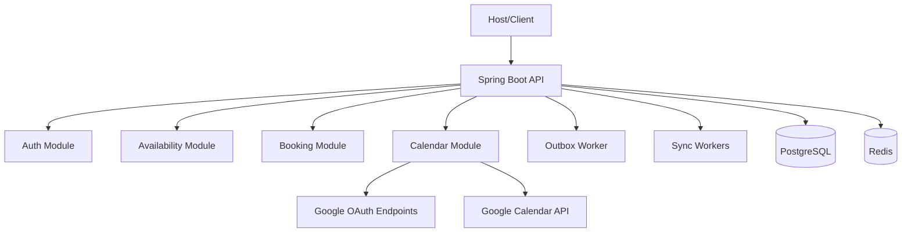
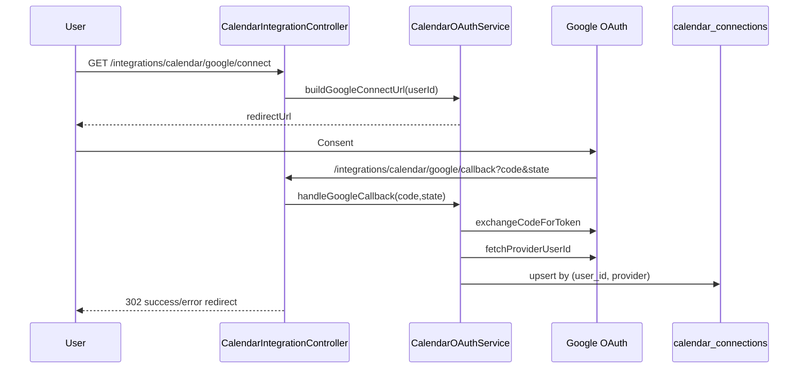
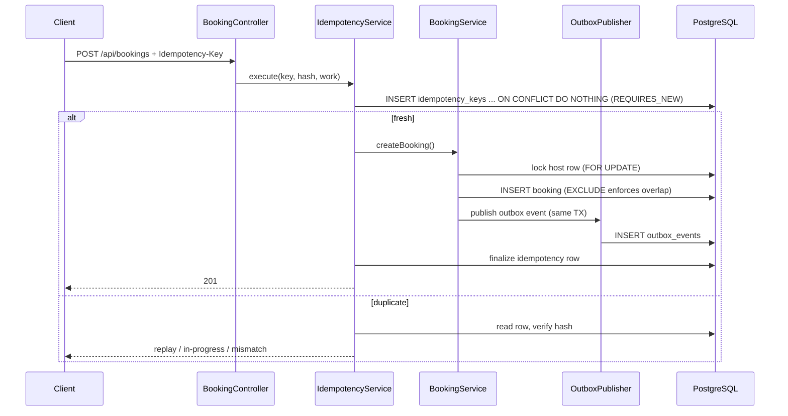
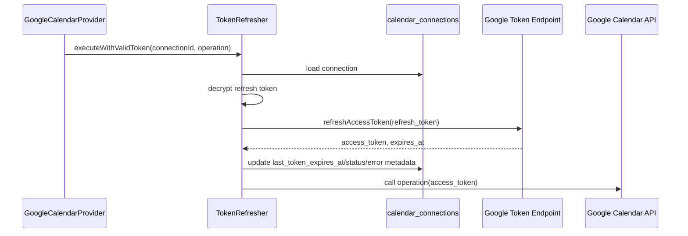
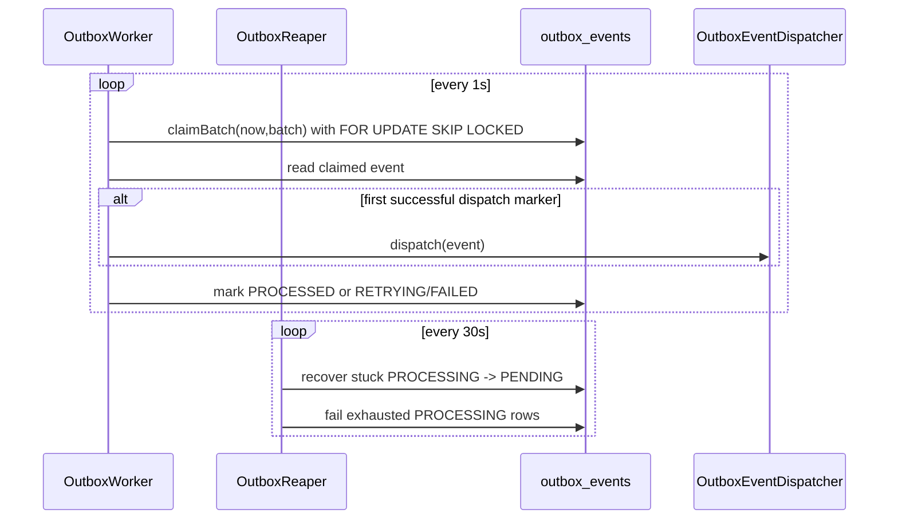

# BunnyCal — Production Architecture (Current)

> **Source of truth.** This document is reverse-engineered from the current codebase in this workspace, not historical HLD/LLD intent. If this document conflicts with code, code wins.
>
> Prior baseline referenced commit `bd165a4` on `booking`; this revision explicitly marks drift and updates stale claims.

---

## Table of Contents

1. [Executive Summary](#1-executive-summary)
2. [Document Drift Audit](#2-document-drift-audit)
3. [System Overview](#3-system-overview)
4. [Architecture Diagrams](#4-architecture-diagrams)
5. [Authentication & Identity](#5-authentication--identity)
6. [Availability & Slot Generation](#6-availability--slot-generation)
7. [Booking System](#7-booking-system)
8. [Concurrency & Consistency](#8-concurrency--consistency)
9. [Data Architecture](#9-data-architecture)
10. [Calendar Integration](#10-calendar-integration)
11. [Async Processing: Outbox + Sync](#11-async-processing-outbox--sync)
12. [Observability](#12-observability)
13. [Security Posture](#13-security-posture)
14. [Critical Risks & Gaps](#14-critical-risks--gaps)
15. [Bottom Line](#15-bottom-line)

---

## 1. Executive Summary

BunnyCal is a modular monolith implementing:
- OAuth login + JWT auth (`auth/*`).
- Availability/slot computation with Redis versioned cache (`availability/*`).
- Booking write path with idempotency and DB-backed overlap enforcement (`booking/*`, `db/migration/V3_0__bookings.sql`).
- Transactional outbox and workers (`booking/outbox/*`).
- Calendar integration module with Google OAuth connect/callback, encrypted refresh token storage, and refresh-on-demand API calls (`calendar/*`).
- Additional sync orchestration pipeline (`sync/*`) backed by `calendar_sync_jobs` and ShedLock-scheduled workers.

Key shift vs old doc: calendar/outbox/sync subsystems now exist and are active in code; previous claims that they were missing are no longer correct.

Calendar sync operational semantics (pull-first correctness + webhook acceleration) are documented in:
- `docs/CALENDAR_SYNC_OPERATIONAL_MODEL.md`

---

## 2. Document Drift Audit

Status of major legacy sections from prior architecture doc:

- **System Overview**: ⚠️ Partially outdated.
  - `calendar/`, `outbox`, and `sync` modules now exist and are wired.
- **Booking Deep Dive**: ⚠️ Partially outdated.
  - DB overlap constraint exists (EXCLUDE), but service still locks host row with `SELECT ... FOR UPDATE`.
- **Concurrency & Consistency**: ⚠️ Partially outdated.
  - More mechanisms now exist: EXCLUDE constraints, CAS updates, SKIP LOCKED claims, ShedLock schedulers.
- **Data Architecture**: ❌ Incorrect in old risk callouts.
  - `ddl-auto: create` is no longer present; current runtime config is `ddl-auto: none` with Flyway enabled.
- **Async & Outbox**: ❌ Incorrect in old document.
  - Outbox tables, worker, reaper, retrying status, and processed-event guard are implemented.
- **Security**: ⚠️ Partially outdated.
  - OAuth + JWT paths are implemented; CSRF remains disabled; default secrets still present in `application.yaml`.
- **Calendar Integration**: ❌ Incorrect by omission.
  - Full module exists: OAuth connect/callback, connection state table, token encryption, refresh strategy.

---

## 3. System Overview

### 3.1 Runtime stack
- Spring Boot + Spring Data JPA + Spring Security.
- PostgreSQL + Flyway migrations.
- Redis for slot caching/versioning.
- Micrometer metrics.
- Scheduled jobs with ShedLock (`common/config/SchedulingConfig.java`).

### 3.2 Implemented modules (current)

```
io.bunnycal
├── auth/            # JWT, refresh tokens, OAuth2 login normalization/success handler
├── availability/    # rules/overrides, slot engine, cache+versioning
├── booking/         # booking writes, idempotency, outbox
├── calendar/        # OAuth connect/callback, provider ops, token crypto/refresh
├── sync/            # outbox->sync job orchestration and sync workers
└── common/          # cross-cutting config, errors, time source, audit
```

### 3.3 Scheduling/locking substrate
- Scheduling is enabled by `@EnableScheduling` under `scheduling.enabled=true|missing`.
- ShedLock JDBC provider with DB time is configured (`SchedulingConfig.lockProvider`).

---

## 4. Architecture Diagrams

### 4.1 System Context



### 4.2 Calendar OAuth Connect/Callback



### 4.3 Booking Write + Idempotency + Outbox



### 4.4 Token Refresh Execution Path



### 4.5 Outbox Worker + Reaper



---

## 5. Authentication & Identity

### 5.1 HTTP security model
- Stateless session policy (`SessionCreationPolicy.STATELESS`).
- `JwtAuthenticationFilter` parses `Authorization: Bearer ...`, validates token, and sets principal to `UUID userId`.
- Route gates:
  - `/api/**` and `/integrations/calendar/**` require auth.
  - `/integrations/calendar/google/callback` is permit-all for OAuth redirect handling.

### 5.2 OAuth2 login path
- `CustomOAuth2UserService` maps provider payload to normalized attributes.
- `OAuth2AuthenticationSuccessHandler`:
  - resolves/creates user via `IdentityLinkingService`.
  - issues JWT (`JwtTokenProvider.generateAccessToken`).
  - issues refresh token (`RefreshTokenService.createRefreshToken`).
  - writes JSON response.

### 5.3 Refresh token auth endpoint
- `/auth/refresh` validates refresh token, rotates refresh token, issues new access token.

---

## 6. Availability & Slot Generation

### 6.1 Slot request path
- Endpoint: `GET /api/users/{userId}/event-types/{eventTypeId}/slots?date=...`.
- `SlotService.getSlots`:
  1. Validates request.
  2. Loads host + event type.
  3. Reads cache version snapshot.
  4. Uses `SlotCacheService.getOrCompute` keyed by `(user,eventType,date,version)`.
  5. On miss, computes slots via `SlotGenerationEngine.compute(...)`.
  6. Rechecks version post-compute; caches only if unchanged.
  7. Stamps deterministic slot IDs with `SlotIdGenerator` and snapshot version.

### 6.2 Calendar busy-time integration status
- Current compute path still sets `calendarBusy = List.of()` in `SlotService.compute`; calendar busy windows are not yet injected into slot pruning.

### 6.3 Cache semantics
- Version-based invalidation plus TTL in cache service.
- In-flight coalescing exists in `SlotCacheService` (single compute per key).

---

## 7. Booking System

### 7.1 Current persisted fields vs domain usage
- DB table `bookings` contains `status`, `expires_at`, `version` (`V3_0__bookings.sql`).
- `Booking` JPA entity maps only: `id`, `host_id`, `event_type_id`, `start_time`, `end_time`.
- Status/version/expiry transitions are done with native SQL in `BookingRepository`.

### 7.2 Create flow
- `BookingService.createBooking`:
  - validates input.
  - locks host row via `UserRepository.findByIdForUpdate(hostId)`.
  - checks overlapping pending count (`countOverlappingPending`).
  - saves booking row.
  - publishes outbox event in same transaction.
  - catches `DataIntegrityViolationException` and maps EXCLUDE violations to `SLOT_ALREADY_BOOKED`.

### 7.3 State transitions and expiry
- Service methods exist: confirm, cancel pending/confirmed, expire, complete, update window.
- Transition enforcement uses CAS-style native updates (`updateStatus`, `expireIfPendingAndExpired`, `updateWindow`).
- **No dedicated scheduled booking-expiry job exists in current code.** `expireBooking(...)` is callable but not scheduler-wired.

### 7.4 Optimistic locking
- Booking row-level CAS is implemented via explicit `version` column in SQL predicates.
- JPA `@Version` is not used on `Booking` entity.

---

## 8. Concurrency & Consistency

### 8.1 Booking overlap authority
- Final overlap authority is DB EXCLUDE constraints on each hash partition child (`bookings_no_overlap_pXX` in migration V3).
- App still performs host-row lock + pending-count pre-guard before insert.

### 8.2 Locking mechanisms currently in play
- `SELECT ... FOR UPDATE` on host row (booking create path).
- `FOR UPDATE SKIP LOCKED` claim queries in outbox and sync job repos.
- ShedLock for scheduled workers (`@SchedulerLock` on sync schedulers).
- No Redis distributed lock implementation for booking writes.

### 8.3 Idempotency consistency model
- Phase 1 insert marker in `REQUIRES_NEW` tx (`tryInsert ON CONFLICT DO NOTHING`).
- Phase 2 business execution + finalize in required tx.
- Phase 3 deterministic failure caching in `REQUIRES_NEW`.
- Duplicate callers poll terminal state with bounded jittered backoff.

### 8.4 Notable race/gap
- `BookingController` contains explicit debt note: idempotency scope currently ties to request host value, not authenticated principal.

---

## 9. Data Architecture

### 9.1 Runtime DDL strategy
- `spring.jpa.hibernate.ddl-auto: none`.
- Flyway enabled with `baseline-on-migrate` and `validate-on-migrate`.
- Old risk claiming `ddl-auto:create` is obsolete.

### 9.2 Core tables
- `bookings` partitioned by hash(host_id), with per-partition EXCLUDE constraints.
- `idempotency_keys` with unique scope and cleanup indexes.
- `outbox_events` + `processed_events`.
- `calendar_connections` with hardened schema:
  - unique `(user_id, provider)` index/constraint.
  - `last_token_expires_at`.
  - `scopes` as `TEXT[]` + GIN index.
  - `last_error_code`, `last_error_at`, `last_synced_at`.
- `calendar_provider_operations` with unique `(provider, idempotency_key)`.
- `calendar_sync_jobs` exists and is actively used by sync workers.

### 9.3 Referential integrity
- Integrity is mixed:
  - some relations enforced by app logic and unique constraints.
  - no new explicit FK coverage was added in the hardened calendar migration.

---

## 10. Calendar Integration

### 10.1 OAuth endpoints and service
- Endpoints:
  - `GET /integrations/calendar/google/connect`
  - `GET /integrations/calendar/google/callback`
  - `GET /integrations/calendar/status`
  - `DELETE /integrations/calendar/{provider}`
- `CalendarOAuthService` constructs connect URL, validates state, exchanges code, fetches provider user id, upserts connection.

### 10.2 Token storage and refresh model
- Refresh token is encrypted via `AesGcmTokenCipher` and persisted.
- Access token is used at call time and not persisted to `calendar_connections`.
- Connection keeps expiry metadata (`last_token_expires_at`) and lifecycle fields.

### 10.3 Token refresh execution
- `GoogleCalendarProvider` delegates calendar operations through `TokenRefresher.executeWithValidToken`.
- `TokenRefresher` always refreshes before operation in current implementation (`ensureActiveAccessToken` path calls refresh in both branches).
- On refresh failure:
  - marks `ERROR` or `REVOKED` depending on error classification.
  - records `last_error_code` and `last_error_at`.

### 10.4 Config model
- `GoogleOAuthProperties` binds `google.oauth.*`.
- Required fields include `client-id`, `client-secret`, `redirect-uri`, scopes, frontend redirects.

---

## 11. Async Processing: Outbox + Sync

### 11.1 Transactional outbox (booking module)
- Outbox row persisted in same tx as booking write (`OutboxPublisher`, propagation REQUIRED).
- Worker (`OutboxWorker`):
  - polls every 1s.
  - claims atomically with `UPDATE ... WHERE id IN (SELECT ... FOR UPDATE SKIP LOCKED) RETURNING id`.
  - dispatches then marks status.
  - retries with exponential backoff + jitter; terminal FAILED on max attempts.
- Reaper (`OutboxReaper`): every 30s recovers stuck PROCESSING and fails exhausted rows.
- `processed_events` insert guard prevents duplicate downstream dispatch after crash windows.

### 11.2 Sync orchestration pipeline
- `OutboxProcessor` claims booking sync events and upserts `calendar_sync_jobs`.
- `BookingSyncWorkerScheduler` and `BookingSyncWorker` process pending jobs.
- `BookingSyncReconcileScheduler` + `BookingSyncReconciler` reconcile observed state.
- Separate `SyncWorker` path also exists for `calendar_event_mappings` lifecycle/fencing.

### 11.3 Scheduler coordination
- Sync schedulers use ShedLock (`@SchedulerLock`) to avoid multi-instance double execution.

---

## 12. Observability

### 12.x Calendar Projection Hardening Notes (RFC v3)
- `sync.projection.apply.duration.ms` measures end-to-end projection apply transaction duration (lock + compare + write), not pure DB lock wait time.
- Ambiguous comparator outcomes are feature-flagged by `sync.projection.accept-ambiguous`.
- Projection ordering semantics are documented in [`ADR_SYNC_PROJECTION_VERSION_SEMANTICS.md`](./ADR_SYNC_PROJECTION_VERSION_SEMANTICS.md).
- Lineage propagation semantics and limits are documented in [`ADR_SYNC_LINEAGE_CONTEXT_SEMANTICS.md`](./ADR_SYNC_LINEAGE_CONTEXT_SEMANTICS.md).
- Composite invariant classification is backed by an explicit 288-row reviewed matrix (`src/main/resources/sync/composite_state_matrix.csv`) with startup/CI coverage validation.
- Replay/convergence model and non-guarantees are documented in [`ADR_SYNC_REPLAY_CONVERGENCE_GUARANTEES.md`](./ADR_SYNC_REPLAY_CONVERGENCE_GUARANTEES.md).
- External-action semantics are documented in [`ADR_SYNC_EXTERNAL_ACTION_SEMANTICS.md`](./ADR_SYNC_EXTERNAL_ACTION_SEMANTICS.md).
- Deterministic shadow reconcile decisions are documented in [`ADR_SYNC_DETERMINISTIC_RECONCILE_DECISIONS.md`](./ADR_SYNC_DETERMINISTIC_RECONCILE_DECISIONS.md).
- Canonical input hash contract is documented in [`ADR_SYNC_CANONICAL_SNAPSHOT_SERIALIZATION.md`](./ADR_SYNC_CANONICAL_SNAPSHOT_SERIALIZATION.md).
- Shadow parity taxonomy governance is documented in [`ADR_SYNC_PARITY_SEMANTICS.md`](./ADR_SYNC_PARITY_SEMANTICS.md).
- Replay fixture format is documented in [`ADR_SYNC_REPLAY_FIXTURE_FORMAT.md`](./ADR_SYNC_REPLAY_FIXTURE_FORMAT.md).
- Provider replay assumptions are documented in [`ADR_SYNC_PROVIDER_REPLAY_ASSUMPTIONS.md`](./ADR_SYNC_PROVIDER_REPLAY_ASSUMPTIONS.md).
- Recurring-event limitations are documented in [`ADR_SYNC_RECURRING_EVENT_LIMITATIONS.md`](./ADR_SYNC_RECURRING_EVENT_LIMITATIONS.md).
- Convergence proving strategy is documented in [`ADR_SYNC_CONVERGENCE_PROVING.md`](./ADR_SYNC_CONVERGENCE_PROVING.md).
- Shadow divergence interpretation is documented in [`ADR_SYNC_SHADOW_DIVERGENCE_INTERPRETATION.md`](./ADR_SYNC_SHADOW_DIVERGENCE_INTERPRETATION.md).

Implemented metrics/logging include:
- Booking conflict counters and completion latency (`BookingService`).
- Idempotency outcome/replay/poll/finalize-race metrics (`IdempotencyService`).
- Outbox lag/retries/failures/processing latency (`OutboxWorker`).
- Calendar token refresh success/failure counters (`TokenRefresher`).
- Sync success/failure/retry/provider latency metrics (`BookingSyncWorker`, `SyncWorker`).
- Structured log events in booking, outbox, calendar connect/refresh, and sync paths.

---

## 13. Security Posture

### 13.1 Implemented controls
- JWT signature verification with minimum secret length check.
- Stateless API auth.
- OAuth2 login normalization and validation of required identity fields.
- Calendar refresh token encryption (AES-GCM).

### 13.2 Current weaknesses
- `csrf` is disabled globally.
- No explicit CORS policy config in `SecurityConfig`.
- `application.yaml` contains insecure default secret fallbacks for JWT/OAuth/security values; safe deployment requires overriding via env.

---

## 14. Critical Risks & Gaps

### 🔴 High

1. **No scheduler-wired booking expiry despite persisted `expires_at`.**
   - `expireBooking(...)` exists but no scheduled invoker in booking module.
   - Effect: stale PENDING rows can persist if not externally advanced.

2. **Dual/overlapping async sync mechanisms increase complexity and split-brain risk.**
   - Both outbox->calendar_sync_jobs path and legacy mapping-based `SyncWorker` path are present.
   - Operationally hard to reason about single source of truth for calendar side effects.

3. **Default secrets in config are production-dangerous if not overridden.**
   - JWT, OAuth client values, and calendar security defaults are present in `application.yaml`.

### 🟡 Medium

4. **Availability engine still ignores provider busy windows in compute path.**
   - `calendarBusy` currently hardcoded empty in `SlotService.compute`.

5. **Idempotency scope debt is acknowledged in code.**
   - Controller note indicates scope should be auth principal semantics.

6. **TokenRefresher always refreshes token before operation.**
   - Functionally correct but adds avoidable token endpoint load; branch logic currently does not use cached validity window.

### 🟢 Resolved from previous doc

- Outbox is implemented and operational (worker + reaper + retrying state).
- Calendar module exists with OAuth callback and connection lifecycle handling.
- `ddl-auto:create` destructive mode is no longer active (`ddl-auto:none` now).

---

## 15. Bottom Line

The system has materially improved from the prior baseline: booking overlap enforcement is DB-backed, outbox infrastructure is live, calendar OAuth integration is implemented, token-at-rest encryption is present, and Flyway/DDL posture is safer.

It is **closer to production-safe** than the old documented state, but not fully clean:
- booking expiry automation remains a real correctness gap,
- async sync architecture is duplicated and should be consolidated,
- security defaults must be hardened in deployment,
- slot computation still lacks provider busy-time integration.

For scale and operability, the next hardening step is convergence on one sync pipeline, explicit expiry processing, and strict secret/config hygiene.
