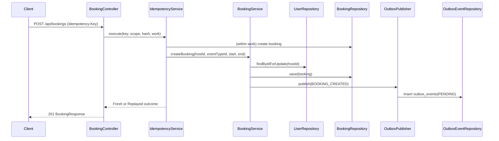
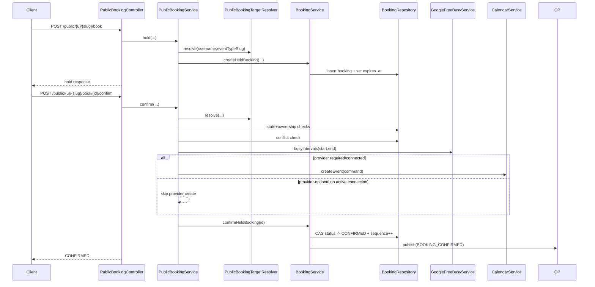
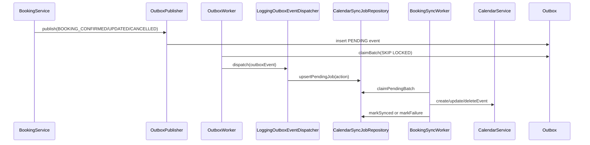
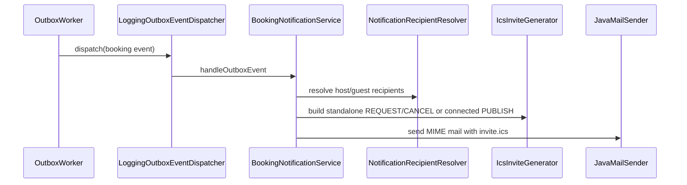

# BOOKING_FLOWS.md

Implementation-accurate backend flow documentation for the current booking system.

## Source Basis
- Directly implemented sources include:
  - `src/main/java/com/daedalussystems/easySchedule/booking/controller/BookingController.java`
  - `src/main/java/com/daedalussystems/easySchedule/booking/controller/PublicBookingController.java`
  - `src/main/java/com/daedalussystems/easySchedule/booking/service/BookingService.java`
  - `src/main/java/com/daedalussystems/easySchedule/booking/service/PublicBookingService.java`
  - `src/main/java/com/daedalussystems/easySchedule/booking/service/DefaultPublicBookingTargetResolver.java`
  - `src/main/java/com/daedalussystems/easySchedule/booking/notification/BookingNotificationService.java`
  - `src/main/java/com/daedalussystems/easySchedule/booking/notification/IcsInviteGenerator.java`
  - `src/main/java/com/daedalussystems/easySchedule/booking/outbox/*`
  - `src/main/java/com/daedalussystems/easySchedule/calendar/service/*`
  - `src/main/resources/db/migration/*` (bookings/outbox/sync/idempotency)
- Where behavior is not explicitly wired in one place, this doc marks it as **Inferred**.

---

## 1. High-Level System Overview

### Main architectural concepts
- Booking write model is centered on `bookings` with state transitions and optimistic CAS updates (`version`) plus overlap enforcement in PostgreSQL.
- Booking side effects are event-driven via transactional outbox (`outbox_events`) and processed asynchronously.
- Public booking supports both normal users and draft-backed hosts through a single resolver abstraction.
- Calendar integration has two distinct paths:
  - Synchronous confirm-time creation for public confirm (in `PublicBookingService.ensureCalendarEventCreated`).
  - Async sync job pipeline triggered by outbox events (`LoggingOutboxEventDispatcher` -> `calendar_sync_jobs` -> sync workers).

### Booking ownership model
- Booking row ownership uses `host_id` (UUID).
- Public draft ownership resolves through shadow user/event IDs (`HostDraft.shadowUserId`, `shadowEventTypeId`) when public username is `d`.
- Host identity for invites in providerless mode now uses application organizer identity (`booking.notifications.calendar-organizer-email/name`) and treats host+guest as attendees.

### Standalone vs connected calendar behavior
- **Connected provider present**:
  - Public availability merges internal slots + freebusy when connected and enabled.
  - Public confirm may create external Google event synchronously.
  - Notifications use passive `METHOD:PUBLISH` snapshots.
- **Providerless (standalone) with `booking.public.provider-optional.enabled=true`**:
  - Availability still computed from internal scheduling engine and returns degraded/calendar-not-connected status.
  - Confirm skips sync if no active provider.
  - Notifications use app-owned authoritative ICS (`REQUEST`/`CANCEL`) with both host+guest attendees.

### Host vs guest semantics
- Host is booking owner (`host_id`), guest details on booking row (`guest_email`, `guest_name`).
- In standalone notification ICS:
  - Organizer is app calendar identity.
  - Host and guest are attendees (deduped, filtered).

### Booking state lifecycle
- States in `BookingState`: `PENDING`, `CONFIRMED`, `CANCELLED`, `EXPIRED`, `COMPLETED`, `REJECTED`.
- Key transitions enforced in service + CAS SQL updates:
  - Create held booking -> `PENDING`
  - Confirm hold -> `CONFIRMED`
  - Reschedule -> window update (status remains pending/confirmed)
  - Cancel -> `CANCELLED`
  - Expiry scheduler -> `EXPIRED`

### Calendar event ownership semantics
- Connected mode: external provider effectively authoritative for meeting lifecycle.
- Standalone mode: application identity is organizer-of-record in ICS.

### How invites are generated and sent
- `BookingNotificationService.handleOutboxEvent` consumes booking outbox events.
- Resolves recipients (`NotificationRecipientResolver`) and deliverability (`EmailDeliverabilityPolicy`).
- Generates ICS via `IcsInviteGenerator` and sends via `JavaMailSender` with `text/calendar; method=<...>` attachment content type.

### Organizer authority location
- Configured in `application.yaml`:
  - `booking.notifications.calendar-organizer-email`
  - `booking.notifications.calendar-organizer-name`
- Used in standalone branch in `BookingNotificationService`.

---

## 2. Entry Points

### Authenticated booking endpoints

| Method | URL | Auth | Request | Response | Main services |
|---|---|---|---|---|---|
| `GET` | `/api/bookings/hosts/{hostId}/meetings` | Expected authenticated host context (controller itself has no explicit annotation-level auth check) | query: `upcomingOnly`, `limit` | `ApiResponse<List<MeetingSummaryResponse>>` | `MeetingQueryService` |
| `POST` | `/api/bookings` | Expected authenticated context; requires `Idempotency-Key` header | `CreateBookingRequest { hostId, eventTypeId, startTime, endTime }`, optional `X-Timezone` | idempotent `ResponseEnvelope` -> `BookingResponse` | `TimeConversionService`, `IdempotencyService`, `BookingService` |

Directly implemented in: `BookingController`.

### Public booking endpoints

| Method | URL | Auth | Request | Response | Main services |
|---|---|---|---|---|---|
| `GET` | `/public/{username}/{eventTypeSlug}` | public | path params | `ApiResponse<PublicEventInfoResponse>` | `PublicBookingService.eventInfo` |
| `GET` | `/public/{username}/{eventTypeSlug}/availability?date=YYYY-MM-DD` | public | date query | `ApiResponse<SlotResponse>` | `PublicBookingService.availability` |
| `POST` | `/public/{username}/{eventTypeSlug}/book` | public + `Idempotency-Key` | `PublicBookRequest { startTime, guestEmail, guestName }`, optional `X-Timezone` | idempotent hold response | `IdempotencyService`, `PublicBookingService.hold` |
| `POST` | `/public/{username}/{eventTypeSlug}/book/{bookingId}/confirm` | public | path params | `ApiResponse<PublicConfirmResponse>` | `PublicBookingService.confirm` |
| `POST` | `/public/{username}/{eventTypeSlug}/book/{bookingId}/cancel` | public + `Idempotency-Key` | path params | idempotent cancel response | `IdempotencyService`, `PublicBookingService.cancel` |
| `POST` | `/public/{username}/{eventTypeSlug}/book/{bookingId}/reschedule` | public + `Idempotency-Key` | `PublicRescheduleRequest { startTime }`, optional `X-Timezone` | idempotent reschedule response | `IdempotencyService`, `PublicBookingService.reschedule` |

Directly implemented in: `PublicBookingController`.

### Draft endpoints (adjacent to public booking)
- `/public/drafts` (`POST`, `GET`, `PUT`), `/api/drafts/{slug}/claim`.
- Public booking itself is still on `/public/{username}/{eventTypeSlug}`; drafts route into this via username `d` + resolver.

---

## 3. Authenticated Booking Flow (Current Runtime)

### Create booking (`POST /api/bookings`)
1. `BookingController.create` validates presence of `Idempotency-Key`.
2. Normalizes client times with `TimeConversionService.normalizeClientInstant`.
3. Computes request hash (`RequestHasher`).
4. Executes idempotency scope via `IdempotencyService.execute`.
5. Inside idempotent work closure: calls `BookingService.createBooking`.
6. `BookingService.createBooking`:
   - validates input and time ordering.
   - locks host row (`UserRepository.findByIdForUpdate`) to serialize host booking attempts.
   - checks `countOverlappingPending` guard.
   - saves booking row.
   - publishes outbox `BOOKING_CREATED` in same transaction (`OutboxPublisher`).
7. If DB exclusion overlap violation (`23P01`/`bookings_no_overlap*`) surfaces, maps to `SLOT_ALREADY_BOOKED`.
8. On success returns `BookingResponse` via idempotency envelope.

### Persistence writes
- `bookings` row inserted (`PENDING` default from migration).
- `outbox_events` row inserted (`BOOKING_CREATED`, `PENDING`).
- `idempotency_keys` row inserted/finalized.

### Sync/notification side effects
- Not done synchronously by controller.
- Asynchronous outbox worker later dispatches notification/sync side effects.

### Authenticated update/cancel/confirm internals
- Runtime mutations happen through `BookingService` methods:
  - `confirmBooking` uses `updateStatusAndCalendarSequence` and emits `BOOKING_CONFIRMED`.
  - `updateBooking` uses `updateWindowAndCalendarSequence` and emits `BOOKING_UPDATED`.
  - `cancelBooking` transitions to `CANCELLED` with sequence increment and emits `BOOKING_CANCELLED`.

**Inferred note**: There is no authenticated REST endpoint in `BookingController` for confirm/cancel/reschedule currently; these transitions are exercised via public flow and tests.

---

## 4. Anonymous/Public Booking Flow (Current Runtime)

### Identity resolution
- `PublicBookingService` resolves target through `PublicBookingTargetResolver`.
- `DefaultPublicBookingTargetResolver` branches:
  - `username == "d"`: lookup active non-expired `HostDraft` by slug; map to shadow user/event type.
  - else: normal user by username + event type slug.

### Availability (`GET /public/.../availability`)
1. Resolve target user/event.
2. Check Google connection status.
3. Branches:
   - provider-optional OFF + missing/disconnected: short-circuit `CALENDAR_NOT_CONNECTED` no slots.
   - provider-optional ON + missing/disconnected: compute internal slots and return degraded + `CALENDAR_NOT_CONNECTED`.
   - syncing/pending when optional OFF: short-circuit `CALENDAR_SYNC_IN_PROGRESS`.
4. Compute base slots from `SlotService`.
5. If freebusy eligible, fetch busy intervals and filter slots.
6. On freebusy failure, fallback to base slots with degraded flag.

### Hold (`POST /public/.../book`)
1. Idempotency validation and hash includes normalized guest fields.
2. Resolve target and duration.
3. `BookingService.createHeldBooking`:
   - create booking
   - set pending expiry
4. Return hold details including expiry and time window.

### Confirm (`POST /public/.../confirm`)
1. Resolve target and verify booking belongs to resolved host/event.
2. Conflict checks:
   - internal conflict query excluding same booking.
   - freebusy overlap check.
3. Calendar creation path:
   - optional OFF: must ensure synchronous calendar event creation.
   - optional ON + active connection: best-effort sync create attempt.
   - optional ON + no connection: skip calendar create (logged).
4. Confirm held booking via `BookingService.confirmHeldBooking`.
5. Emits `BOOKING_CONFIRMED` outbox event through booking service.

### Cancel / Reschedule
- Cancel:
  - resolve + state lookup
  - `BookingService.cancelBooking`
  - returns booking status/times.
- Reschedule:
  - resolve + state lookup
  - conflict + freebusy checks
  - `BookingService.updateBooking`
  - returns updated window.

### Public vs authenticated differences
- Public flow has explicit target resolver and draft support.
- Public confirm may synchronously call provider creation in `PublicBookingService`.
- Authenticated create path is strictly write + outbox and does not synchronously create provider event.

---

## 5. Sequence Diagrams

### Authenticated create booking

### Public hold + confirm

### Booking + Google sync async path

### Booking + email + ICS

---

## 6. Transaction & Consistency Model

### Transaction boundaries
- `BookingService` mutation methods are `@Transactional`.
- `OutboxPublisher` joins ambient transaction (`REQUIRED`).
- `IdempotencyService` explicitly uses `TransactionTemplate` for phase-specific transaction scopes (`REQUIRES_NEW` for insert/failure finalize).
- `OutboxWorker` claims and processes each event in separate `REQUIRES_NEW` templates.

### Idempotency protections
- API idempotency via `idempotency_keys` scoped by `(user_id, route, key)`.
- Request hash mismatch returns conflict/validation errors.
- In-progress polling/replay behavior implemented in service.

### Race condition prevention
- DB overlap exclusion constraints (`bookings_no_overlap_pXX`) are authority.
- Host row lock + pending-count guard reduce contention.
- CAS updates on state/version prevent stale transitions.
- Outbox worker claim uses `FOR UPDATE SKIP LOCKED` and terminal guard.
- `processed_events` insert acts as dispatch de-duplication guard.

### Retry and eventual consistency
- Outbox retry with exponential backoff + jitter.
- Terminal outbox failure after `OUTBOX_MAX_ATTEMPTS`.
- Calendar sync jobs independently retry/fail permanent.
- Notification failures are logged and non-fatal to booking transaction.

### Failure recovery
- Outbox reaper moves stuck `PROCESSING` back to `PENDING` or `FAILED` if exhausted.
- Public confirm calendar mapping has claim/fence/finalize flow with retry/in-progress handling.

---

## 7. External Integrations

### Google Calendar
- Sync create/update/delete via `CalendarService` and `CalendarProviderClient` implementations.
- Public confirm may synchronously create Google event when configured conditions require.
- Async sync jobs also drive provider operations.

### Google FreeBusy
- Used in public availability + confirm/reschedule conflict checks.
- Failures can degrade/fallback depending on endpoint path.

### Email + ICS
- SMTP via Spring `JavaMailSender`.
- ICS generated in-app with standalone app-owned organizer or connected-mode snapshots.

### Outbox/queue equivalent
- No external queue broker; DB outbox + polling worker pattern.

---

## 8. Known Architectural Decisions (Observed)

- Outbox chosen to keep booking write and side-effect intent atomic.
- Public resolver unifies normal user and draft-backed host under same `/public/{username}/{eventTypeSlug}` surface.
- Provider-optional mode explicitly allows standalone scheduling without active provider.
- Standalone invite ownership moved to app organizer identity to avoid host organizer mailbox interoperability issues.
- Connected-provider notifications kept passive to avoid duplicate organizer authority with Google.

---

## 9. Current Risks / TODOs / Tech Debt (Code-observable)

1. **Dual async sync pipelines present**
   - `OutboxWorker` + `LoggingOutboxEventDispatcher` path and `sync/orchestration/OutboxProcessor` path both exist.
   - Directly implemented; activation overlap is not obvious in this pass (**Inferred risk**: operational confusion/duplicate responsibilities).

2. **Public confirm does blocking wait loop**
   - `awaitMappingCreated` sleeps/polls up to 5s in request transaction.
   - Risk: latency spikes and thread blocking under provider contention.

3. **Known idempotency scope debt in authenticated create**
   - Controller comment notes scope keyed by request host ID rather than true auth subject.

4. **Mixed sync semantics**
   - Some calendar creation happens sync in public confirm; other lifecycle operations rely on async jobs.
   - Can make operator expectations harder (timing/ownership differences).

5. **Notification send failure handling is warn-only**
   - No DLQ/retry loop for email at notification layer (outbox event still processed).

