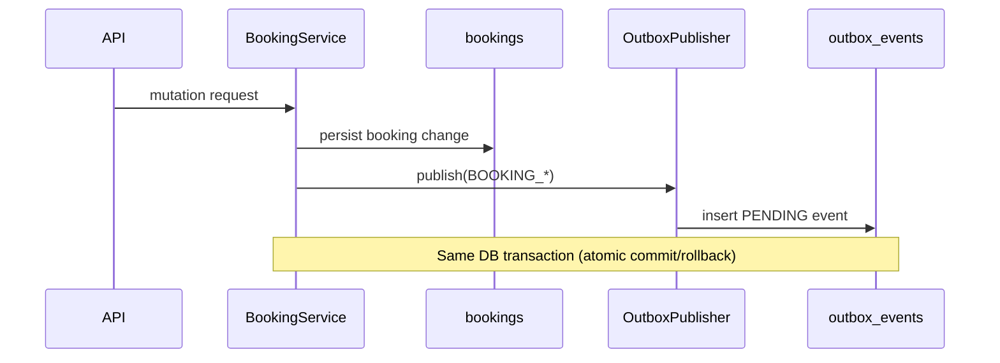
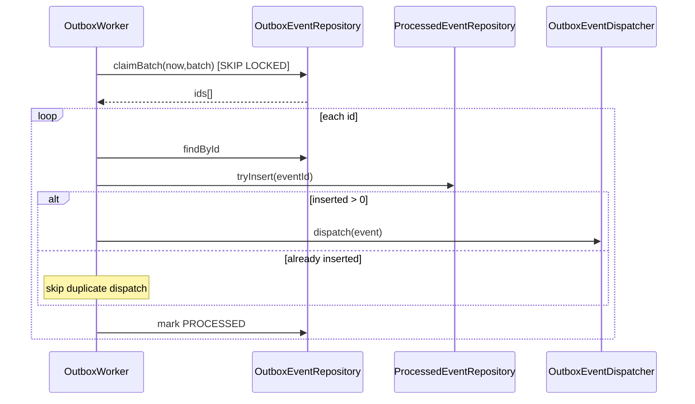
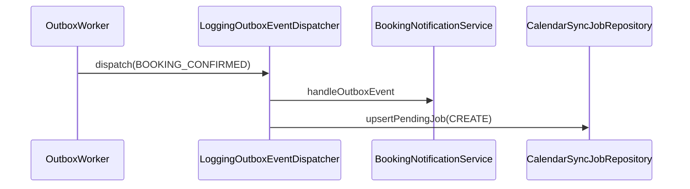
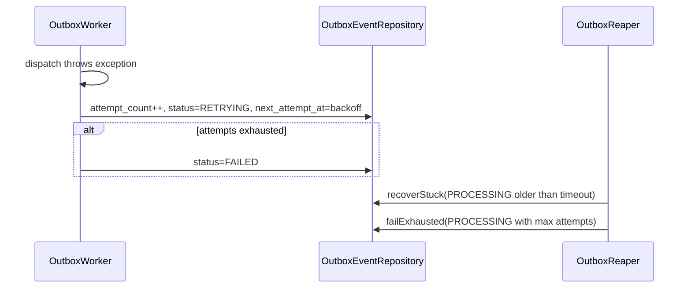

# OUTBOX_EVENT_FLOW.md

Implementation-accurate deep dive of async outbox/event processing in current backend.

## Source Basis
- Primary sources:
  - `src/main/java/com/daedalussystems/easySchedule/booking/outbox/*`
  - `src/main/java/com/daedalussystems/easySchedule/booking/service/BookingService.java`
  - `src/main/java/com/daedalussystems/easySchedule/booking/notification/BookingNotificationService.java`
  - `src/main/java/com/daedalussystems/easySchedule/sync/worker/*`
  - `src/main/java/com/daedalussystems/easySchedule/sync/orchestration/*`
  - migrations: `V4_0__outbox.sql`, `V16_0__outbox_retrying_and_nullable_next_attempt.sql`, `V22_0__calendar_sync_jobs.sql`

Where runtime activation is not explicit from one file, this doc marks **Inferred**.

---

## 1. Architecture Overview

### Why outbox is used
- Booking writes and side-effect intents are committed atomically.
- `OutboxPublisher` writes outbox rows in same transaction as booking mutation (`@Transactional(REQUIRED)`).

### Current event-driven architecture
- Producer: booking domain service emits booking events into `outbox_events`.
- Consumer: `OutboxWorker` polls and dispatches via `OutboxEventDispatcher` implementation (`LoggingOutboxEventDispatcher`).
- Side effects from dispatcher:
  - notification handling (`BookingNotificationService`)
  - calendar sync job upsert (`calendar_sync_jobs`).

### Delivery semantics
- At-least-once delivery for outbox dispatch attempts.
- Duplicate downstream dispatch protected by `processed_events.tryInsert` guard in worker transaction.
- Exactly-once end-to-end is not guaranteed globally; idempotency is enforced at critical boundaries.

---

## 2. Outbox Data Model

### `outbox_events` schema (direct from migrations/entity)
- Columns:
  - `id` UUID PK
  - `aggregate_type` (`Booking`)
  - `aggregate_id` (booking UUID)
  - `event_type` (`BOOKING_CREATED`, `BOOKING_CONFIRMED`, etc.)
  - `payload` JSON text (envelope)
  - `status` enum-like string
  - `attempt_count`
  - `next_attempt_at`
  - `last_error`
  - `created_at`, `updated_at`
- Status values (current):
  - `PENDING`, `PROCESSING`, `RETRYING`, `PROCESSED`, `FAILED`

### `processed_events`
- `event_id` PK, `processed_at`
- Used as de-duplication guard after successful side-effect dispatch.

### Payload format
- `OutboxPayloadEnvelope`:
  - `eventId`, `type`, `version`, `payload`
- Persisted as JSON string by `OutboxPublisher`.

---

## 3. Event Production Flow

### Producer locations (directly implemented)
- `BookingService.createBooking` -> publish `BOOKING_CREATED`.
- `BookingService.confirmBooking` -> publish `BOOKING_CONFIRMED`.
- `BookingService.updateBooking` -> publish `BOOKING_UPDATED`.
- `BookingService.cancelBooking` -> publish `BOOKING_CANCELLED`.

### Transaction coupling
- Publish happens inside booking transaction.
- If booking transaction rolls back, outbox row rolls back.

### Trigger conditions
- Event emission only after successful CAS/persistence transitions in each method.

---

## 4. Event Consumption Flow

## Primary outbox worker path
- `OutboxWorker.poll` (`@Scheduled(fixedDelay=1000)`).
- Claim step:
  - `OutboxEventRepository.claimBatch(now, batchSize)` uses `FOR UPDATE SKIP LOCKED` and marks claimed rows `PROCESSING` atomically.
- Process step per event:
  - load event in new tx
  - insert `processed_events` guard row (`tryInsert`)
  - dispatch event
  - mark outbox row `PROCESSED`
- Failure step:
  - increment attempt
  - if max attempts reached -> `FAILED`
  - else -> `RETRYING` with backoff/jitter next attempt time.

## Reaper path
- `OutboxReaper.recoverStuck` (`@Scheduled(fixedDelay=30000)`):
  - recovers stale `PROCESSING` rows to `PENDING`
  - permanently fails exhausted stale rows.

## Dispatcher side effects
- `LoggingOutboxEventDispatcher.dispatch`:
  - calls `BookingNotificationService.handleOutboxEvent` when bean present.
  - maps booking events to desired sync actions and upserts `calendar_sync_jobs`, with provider-optional skip when no active connection.

---

## 5. Booking-Related Event Lifecycle

### Booking created
- `BOOKING_CREATED` produced.
- Dispatcher currently logs/dispatches; sync job router only maps confirmed/updated/cancelled to sync actions.
- Notification service listens only for `BOOKING_CONFIRMED`, `BOOKING_UPDATED`, `BOOKING_CANCELLED`.

### Booking confirmed
- Outbox event consumed.
- Notification service sends emails + ICS.
- Sync job upsert action: `CREATE` (unless provider-optional no-connection skip).

### Booking updated
- Notification + sync job `UPDATE`.

### Booking cancelled
- Notification + sync job `DELETE`.

---

## 6. External Side Effects from Outbox

### Email delivery
- Triggered in dispatcher through `BookingNotificationService`.
- Non-fatal send errors logged inside notification service.

### Calendar sync jobs
- Triggered in dispatcher via `CalendarSyncJobRepository.upsertPendingJob`.
- Jobs processed by `BookingSyncWorkerScheduler` -> `BookingSyncWorker`.

### Google provider operations
- Worker executes create/update/delete via `CalendarService` and provider clients.
- Failure classification drives retry/permanent-fail behavior.

### Ordering/consistency notes
- Per-row outbox processing attempts are serialized by claim+status updates.
- Global strict ordering across aggregates is not guaranteed.

---

## 7. Reliability & Failure Modes

### Crash recovery
- Crash after claim before completion: reaper resets stale `PROCESSING` rows.

### Duplicate prevention
- `processed_events.tryInsert` prevents redispatch after commit races/recovery.

### Retry behavior
- Outbox worker retry capped by `OUTBOX_MAX_ATTEMPTS` with exponential backoff + jitter.
- Sync job worker has separate retry policy and permanent failure classification.

### Poison message handling
- Outbox: `FAILED` terminal state (DLQ-like stop).
- Sync jobs: status transitions to failed/permanent based on policy.

### Observability
- Metrics:
  - outbox lag, retries, processing latency, booking failed totals
  - sync attempt/result/error metrics and latencies
- Logs include structured markers for sync/outbox actions and failures.

---

## 8. Mermaid Diagrams

### Outbox write in booking transaction

### Worker claim/process loop

### Booking event to side effects

### Failure + retry path

---

## 9. Additional Notes / Ambiguities

1. **Secondary orchestration path exists**
- `sync/orchestration/OutboxProcessor` also claims booking sync events and creates sync jobs.
- This is directly implemented but no `@Scheduled` exists in `OutboxProcessor` itself.
- `BookingSyncReconcileScheduler` and sync worker schedulers are active.
- Whether `OutboxProcessor` is actively invoked in production runtime is **Inferred unclear** from code-only audit.

2. **Outbox status semantics evolved**
- Migration updated status check and nullable `next_attempt_at` for terminal rows.
- Entity/repository behavior aligns with new statuses.

