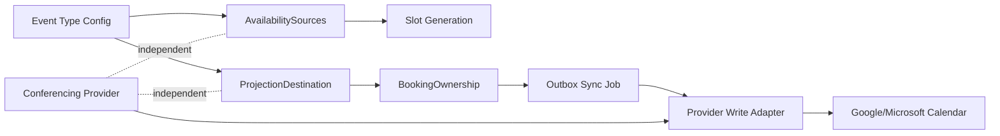

# Phase 1 Ownership Boundaries

## Updated Architecture Diagram

## Ownership Boundary Specification

- `Authentication provider` does not determine organizer or projection ownership.
- `AvailabilitySources` are read-only inputs for slot conflict computation.
- `ProjectionDestination` is the only calendar write target.
- `Conferencing provider` remains independent from projection ownership.
- `APPLICATION` is the only organizer lifecycle authority.

## Domain Model Changes

- `CreateEventTypeRequest` now includes mandatory `projectionDestination` for primary event-type creation:
  - `provider`
  - `connectionId`
  - `calendarId`
- `EventType` now persists:
  - `projectionProvider`
  - `projectionConnectionId`
  - `projectionCalendarId`
- New `booking_ownership` model persisted per booking:
  - `bookingId`
  - `organizerAuthority=APPLICATION`
  - `projectionProvider`
  - `projectionConnectionId`
  - `projectionCalendarId`
  - `providerExternalEventId`
  - `ownershipVersion`
  - `ownershipState`

## Removed Fallback Paths

- Removed scheduling fallback to oldest active connection in `LoggingOutboxEventDispatcher`.
- Removed projection destination inference from connected account order.
- Provider write path now requires explicit projection calendar (`projectionCalendarId`) from event type.

## Migration Plan

Migration `V59_0__event_projection_ownership_and_booking_ownership.sql`:

1. Adds projection ownership columns to `event_types`.
2. Backfills projection ownership from deterministic legacy organizer connection when possible.
3. Creates `booking_ownership` table.
4. Backfills booking ownership rows for all existing bookings.
5. Marks unresolved historical rows as `ownership_state=AMBIGUOUS` with `ambiguity_reason`.
6. Backfills `provider_external_event_id` from sync jobs where present.

## Backfill Strategy

- Deterministic rows are backfilled to `RESOLVED`.
- Ambiguous rows are explicitly labeled and never silently guessed.
- No automatic heuristic assignment for multi-candidate ownership.

## Runtime Validation Strategy

- `EventTypeOrchestrationNormalizer.normalize(...)` hard-fails when `projectionDestination` is absent/invalid.
- Connection ownership and provider match are validated.
- Draft mutation is allowed to remain unresolved only when no explicit projection is supplied; no fallback ownership is inferred.
- Sync enqueue skips when projection ownership is missing, with explicit warning log.

## Observability Additions

- `projection_destination_resolved` log for explicit resolution.
- `booking_ownership_created` and `booking_ownership_external_event_linked` logs.
- `outbox.sync_job_skipped_missing_projection_ownership` warning.
- Provider authority isolation logs:
  - Google: `sendUpdates=none`
  - Microsoft: `responseRequested=false`

## Known Unresolved Ambiguity Cases

- Historical bookings/event types lacking deterministic projection metadata remain flagged `AMBIGUOUS`.
- Draft-host shadow event types can remain unresolved until explicit projection destination is supplied.
